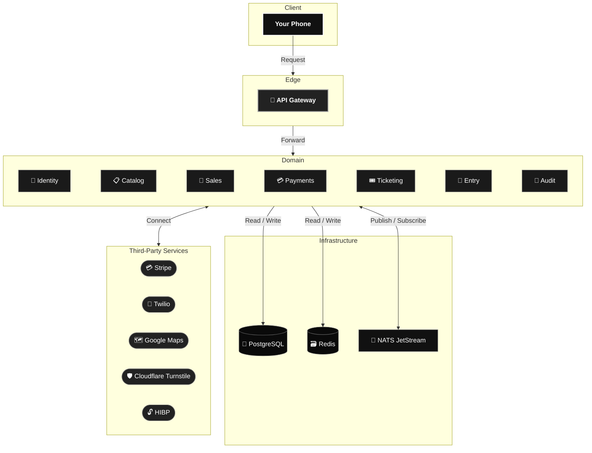

<div align="center">


*Your event, your ticket, your phone.*

</div>

# 📝 **Description**

<div align="center">

***QREW*** is a production-grade **event ticketing platform** built as a native mobile app to make ticket fraud and speculation structurally impossible.

</div>

# 🏗️ **Architecture**

> [!WARNING]
> This is a picture of the system. The full dive into the topic is in [OVERVIEW.md](docs/architecture/overview.md).

<div align="center">



<div align="right">

→ [Full Architecture View](docs/architecture/overview.md)

</div>

</div>

# 📁 **Project Structure**

```
QREW/
├── apps/
│   ├── app/                           # Frontend (:5173)
│   │   ├── src/
│   │   │   ├── routes/
│   │   │   ├── features/
│   │   │   ├── components/
│   │   │   └── lib/
│   │   ├── android/
│   │   └── ios/
│   │
│   └── api/                           # Backend
│       ├── gateway/                   # API Gateway (:8000)
│       └── services/
│           ├── identity/              # Identity Service (:8001)
│           ├── catalog/               # Catalog Service (:8002)
│           ├── sales/                 # Sales Service (:8003)
│           ├── payments/              # Payments Service (:8004)
│           ├── ticketing/             # Ticketing Service (:8005)
│           ├── entry/                 # Entry Service (:8006)
│           └── audit/                 # Audit Service (:8007)
│
├── packages/
│   ├── contracts/
│   ├── shared-python/
│   └── shared-ts/
```

# 🔧 **Installation**

## 📋 Requirements

- **Docker** and **Docker Compose**
- **Node.js 20+** and **npm**
- **Python 3.12+** and **uv**
- **Android Studio** or **Xcode** (For native builds)

## ⚙️ Setup Guides

- ✅ [Prerequisites](docs/development/prerequisites.md)
- 🔑 [Environment Variables](docs/development/configuration.md)
- 🖥️ [Local · Native](docs/development/setup/local-native.md)
- 🐳 [Local · Docker](docs/development/setup/local-docker.md)
- 📲 [Android · USB](docs/development/setup/android-usb.md)
- 📱 [Android · Emulator](docs/development/setup/android-emulator.md)

## ⚡ Quick Start

**1. Clone the repository**

```bash
git clone https://github.com/cristiangilsanz/qrew.git
cd qrew
```

**2. Set up the frontend environment**

```bash
cp apps/app/.env.example apps/app/.env
```

Open `apps/app/.env` and fill in:

| Variable | Description |
|---|---|
| `VITE_GOOGLE_MAPS_API_KEY` | Google Maps API key (venue picker) |
| `VITE_STRIPE_PUBLISHABLE_KEY` | Stripe publishable key (checkout) |
| `VITE_TURNSTILE_SITE_KEY` | Cloudflare Turnstile site key (captcha) |

**3. Set up the backend environment**

Each service has its own `local.yaml`.

Copy all examples:

```bash
for f in $(find apps/api -name "local.yaml.example"); do cp "$f" "${f%.example}"; done
```

Fill in the required secrets across all the service configuration files:

| Secret |
|---|
| `access_jwt_private_key` |
| `pii_encryption_key` |
| `stripe_secret_key` |
| `stripe_webhook_signing_secret` |
| `twilio_account_sid` / `twilio_auth_token` |
| `captcha_secret_key` |
| `storage_signing_key` |

> [!NOTE]
> Most secrets can be left empty for local dev. Features that need them are disabled by default via their `*_enabled: false` flags.

**4. Spin up the full stack**

```bash
docker compose up
```


# 📚 **Tech Stack**

## 🗣️ Languages

[](https://www.python.org/)
[](https://www.typescriptlang.org/)

## 🧩 Frameworks & Libraries

[](https://react.dev/)
[](https://vitejs.dev/)
[](https://fastapi.tiangolo.com/)
[](https://www.uvicorn.org/)
[](https://docs.pydantic.dev/)
[](https://docs.sqlalchemy.org/)
[](https://alembic.sqlalchemy.org/)
[](https://tailwindcss.com/)
[](https://tanstack.com/router)
[](https://tanstack.com/query)
[](https://zustand-demo.pmnd.rs/)
[](https://immerjs.github.io/immer/)
[](https://capacitorjs.com/)
[](https://www.radix-ui.com/)
[](https://www.framer.com/motion/)
[](https://react-hook-form.com/)
[](https://zod.dev/)
[](https://axios-http.com/)
[](https://react.i18next.com/)
[](https://opentelemetry.io/)
[](https://www.structlog.org/)
[](https://slowapi.readthedocs.io/)
[](https://www.python-httpx.org/)
[](https://geoip2.readthedocs.io/)
[](https://github.com/madmaze/pytesseract)
[](https://opencv.org/)
[](https://pillow.readthedocs.io/)
[](https://stripe.com/docs/stripe-js)
[](https://github.com/stripe/stripe-python)
[](https://lucide.dev/)
[](https://sonner.emilkowal.ski/)
[](https://date-fns.org/)
[](https://github.com/rosskhanas/react-qr-code)

## 🗄️ Databases

[](https://www.postgresql.org/)
[](https://redis.io/)
[](https://github.com/MagicStack/asyncpg)

## 🐳 Infrastructure

[](https://www.docker.com/)
[](https://docs.docker.com/compose/)
[](https://www.jaegertracing.io/)

## ⚡ Messaging & Background Jobs

[](https://docs.nats.io/nats-concepts/jetstream)
[](https://github.com/nats-io/nats.py)
[](https://arq-docs.helpmanual.io/)
[](https://redis.io/docs/latest/develop/use/patterns/distributed-locks/)

## 🔐 Security & Auth

[](https://cryptography.io/)
[](https://passlib.readthedocs.io/)
[](https://argon2-cffi.readthedocs.io/)
[](https://pyjwt.readthedocs.io/)
[](https://webauthn.io/)
[](https://simplewebauthn.dev/)
[](https://pyauth.github.io/pyotp/)

## 💳 Third-Party Services

[](https://stripe.com/docs)
[](https://www.twilio.com/docs)
[](https://developers.google.com/maps)
[](https://developers.cloudflare.com/turnstile/)
[](https://haveibeenpwned.com/API/v3)

## 🧪 Testing

[](https://docs.pytest.org/)
[](https://vitest.dev/)
[](https://testing-library.com/)
[](https://testcontainers.com/)
[](https://github.com/cunla/fakeredis-py)
[](https://mswjs.io/)
[](https://factoryboy.readthedocs.io/)

## 🔍 Code Quality

[](https://github.com/microsoft/pyright)
[](https://eslint.org/)
[](https://docs.astral.sh/ruff/)
[](https://prettier.io/)

## 🔧 Tooling

[](https://docs.github.com/en/actions)
[](https://just.systems/)
[](https://docs.astral.sh/uv/)
[](https://typicode.github.io/husky/)
[](https://github.com/lint-staged/lint-staged)
[](https://commitlint.js.org/)
[](https://pre-commit.com/)

# 🙏 **Credits & Thanks**

Thanks to the teams behind [FastAPI](https://fastapi.tiangolo.com/), [TanStack](https://tanstack.com/), [Capacitor](https://capacitorjs.com/), [NATS](https://nats.io/), and [Stripe](https://stripe.com/) for making a project like this possible.

# 📄 **License**

This project is licensed under the MIT License — see the [LICENSE](LICENSE) file for details.

# 📞 **Get Help & Connect**

- 💬 [Start a discussion](https://github.com/cristiangilsanz/qrew/discussions)
- 🐛 [Open an issue](https://github.com/cristiangilsanz/qrew/issues)
- 📧 cristiangilsanz@gmail.com

<div align="center">
  <br>

  **Made with 💖 for the community**

  ⭐ [Star this repo](https://github.com/cristiangilsanz/qrew) · 🍴 [Fork it](https://github.com/cristiangilsanz/qrew/fork)

  <br>

  [](https://www.buymeacoffee.com/cristiangilsanz)

</div>
