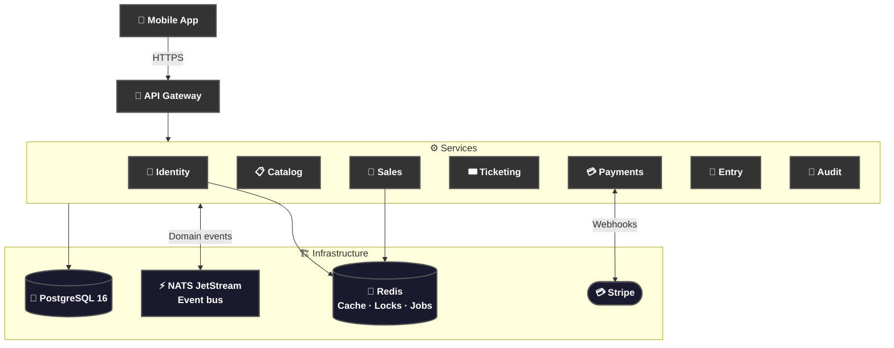

<div align="center">


*Your event, your ticket, your phone.*

</div>

# 📝 **Description**

<div align="center">

***QREW*** is a production-grade **event ticketing platform** built as a native mobile app. Built to make ticket fraud and speculation structurally impossible.

Zero friction. One product. Three roles.

</div>

# 🏗️ **Architecture**

<div align="center">



</div>

---

# 📁 **Project Structure**

```
QREW/
├── README.md                          # You are here! ⬅️
├── ARCHITECTURE.md                    # System architecture deep-dive
├── CONTRIBUTING.md                    # Contribution guidelines
├── SECURITY.md                        # Security policy
├── CHANGELOG.md                       # Release history
├── LICENSE                            # MIT License
├── docker-compose.yml                 # Full local stack
├── Justfile                           # Dev task runner
│
├── apps/
│   ├── app/                           # React + Capacitor mobile app
│   │   ├── src/
│   │   │   ├── routes/                # TanStack Router pages
│   │   │   ├── features/              # Feature modules (organiser, scanner…)
│   │   │   ├── components/            # Shared UI components
│   │   │   └── lib/                   # Utilities, query keys, i18n
│   │   ├── android/                   # Android native project
│   │   └── ios/                       # iOS native project
│   │
│   └── api/
│       ├── gateway/                   # Starlette API gateway (:8000)
│       └── services/
│           ├── identity/              # Auth, users, passkeys, TOTP, KYC
│           ├── catalog/               # Events, venues, organisations
│           ├── sales/                 # Reservations, resale market, queue
│           ├── ticketing/             # Tickets, QR tokens
│           ├── payments/              # Stripe webhooks + disbursements
│           ├── entry/                 # Scanner auth, QR validation
│           └── audit/                 # Immutable audit log
│
├── packages/
│   ├── contracts/                     # Shared API contracts (OpenAPI)
│   ├── shared-python/                 # Shared Python utilities
│   └── shared-ts/                     # Shared TypeScript types
│
└── docs/
    ├── app/                           # Frontend docs
    ├── api/                           # API & service docs
    └── development/                   # Local setup guides
```

---

# 🔧 **Installation**

## 📋 Requirements

- **Docker** and **Docker Compose**
- **Node.js 20+** and **npm**
- **Python 3.12+** and **uv**
- **Android Studio** or **Xcode** (for native builds)

## ⚙️ Setup Guides

| Environment | Guide |
|---|---|
| 🖥️ Local (terminal) | [LOCAL-DEVELOPMENT.md](docs/development/LOCAL-DEVELOPMENT.md) |
| 🐳 Local (containers) | [DOCKER.md](docs/development/DOCKER.md) |
| 📱 Android emulator | [EMULATOR.md](docs/development/EMULATOR.md) |
| 📲 Physical device (USB) | [DEVICE.md](docs/development/DEVICE.md) |
| 🔑 Environment variables | [ENVIRONMENT-VARIABLES.md](docs/development/ENVIRONMENT-VARIABLES.md) |
| ✅ Prerequisites | [PREREQUISITES.md](docs/development/PREREQUISITES.md) |

## ⚡ Quick Start (Docker)

```bash
git clone https://github.com/cristiangilsanz/qrew.git
cd qrew  # the repo folder is lowercase

# Copy env files and fill in your secrets
cp apps/app/.env.example apps/app/.env

# Spin up the full stack
docker compose up
```

The app will be available at `http://localhost:5173` and the API gateway at `http://localhost:8000`.

---

# 📚 **Tech Stack**

## 📱 Frontend

| Layer | Technology |
|---|---|
| Framework | [React 18](https://react.dev/) |
| Routing | [TanStack Router](https://tanstack.com/router) |
| Data fetching | [TanStack Query](https://tanstack.com/query) |
| Styling | [Tailwind CSS](https://tailwindcss.com/) + [shadcn/ui](https://ui.shadcn.com/) |
| Animations | [Framer Motion](https://www.framer.com/motion/) |
| Native runtime | [Capacitor](https://capacitorjs.com/) (Android + iOS) |
| i18n | [react-i18next](https://react.i18next.com/) |

## 🖥️ Backend

| Layer | Technology |
|---|---|
| Gateway | [Starlette](https://www.starlette.io/) |
| Services | [FastAPI](https://fastapi.tiangolo.com/) + [SQLAlchemy](https://docs.sqlalchemy.org/) |
| Auth | JWT ES256, [WebAuthn passkeys](https://webauthn.io/), TOTP, Argon2 |
| Messaging | [NATS JetStream](https://docs.nats.io/nats-concepts/jetstream) |
| Background jobs | [Arq](https://arq-docs.helpmanual.io/) + [Redlock](https://redis.io/docs/latest/develop/use/patterns/distributed-locks/) |
| Migrations | [Alembic](https://alembic.sqlalchemy.org/) |

## 🗃️ Infrastructure

| Layer | Technology |
|---|---|
| Database | [PostgreSQL 16](https://www.postgresql.org/) |
| Cache / Locks | [Redis](https://redis.io/) |
| Payments | [Stripe](https://stripe.com/docs) |
| Notifications | [Resend](https://resend.com/docs) |
| OTP | [Twilio](https://www.twilio.com/docs) |
| Storage | [Cloudflare R2](https://developers.cloudflare.com/r2/) |

## 🧪 Testing & Quality

| Tool | Purpose |
|---|---|
| [Vitest](https://vitest.dev/) + [RTL](https://testing-library.com/) | Frontend unit tests |
| [pytest](https://docs.pytest.org/) | Backend unit & integration tests |
| [MSW](https://mswjs.io/) | API mocking in frontend tests |
| [ruff](https://docs.astral.sh/ruff/) | Python linting + formatting |
| [pyright](https://github.com/microsoft/pyright) | Python type checking |
| [eslint](https://eslint.org/) + [prettier](https://prettier.io/) | TypeScript linting + formatting |

---

# 📖 **Documentation**

| Topic | Link |
|---|---|
| 🏗️ Architecture | [ARCHITECTURE.md](ARCHITECTURE.md) |
| 🗺️ App routing | [docs/app/ROUTING.md](docs/app/ROUTING.md) |
| 🧩 Components | [docs/app/COMPONENTS.md](docs/app/COMPONENTS.md) |
| 🌍 Internationalisation | [docs/app/I18N.md](docs/app/I18N.md) |
| 📦 State management | [docs/app/STATE-MANAGEMENT.md](docs/app/STATE-MANAGEMENT.md) |
| 📱 Capacitor setup | [docs/app/CAPACITOR.md](docs/app/CAPACITOR.md) |
| 🔌 API services | [docs/api/](docs/api/) |
| ⚡ NATS streams | [docs/api/streams.md](docs/api/streams.md) |
| 🤝 Contributing | [CONTRIBUTING.md](CONTRIBUTING.md) |
| 🔒 Security | [SECURITY.md](SECURITY.md) |
| 📋 Changelog | [CHANGELOG.md](CHANGELOG.md) |

---

# 🙏 **Credits & Thanks**

Built with incredible open-source tools — thanks to the teams behind [FastAPI](https://fastapi.tiangolo.com/), [TanStack](https://tanstack.com/), [Capacitor](https://capacitorjs.com/), [NATS](https://nats.io/), and [Stripe](https://stripe.com/) for making a project like this possible.

---

# 📄 **License**

This project is licensed under the MIT License — see the [LICENSE](LICENSE) file for details.

---

# 📞 **Get Help & Connect**

- 💬 [Start a discussion](https://github.com/cristiangilsanz/qrew/discussions)
- 🐛 [Open an issue](https://github.com/cristiangilsanz/qrew/issues)
- 📧 cristiangilsanz@gmail.com

<div align="center">
  <br>

  **Made with 💖 for the community**

  ⭐ [Star this repo](https://github.com/cristiangilsanz/qrew) · 🍴 [Fork it](https://github.com/cristiangilsanz/qrew/fork)

  <br>

  [](https://www.buymeacoffee.com/cristiangilsanz)

</div>
