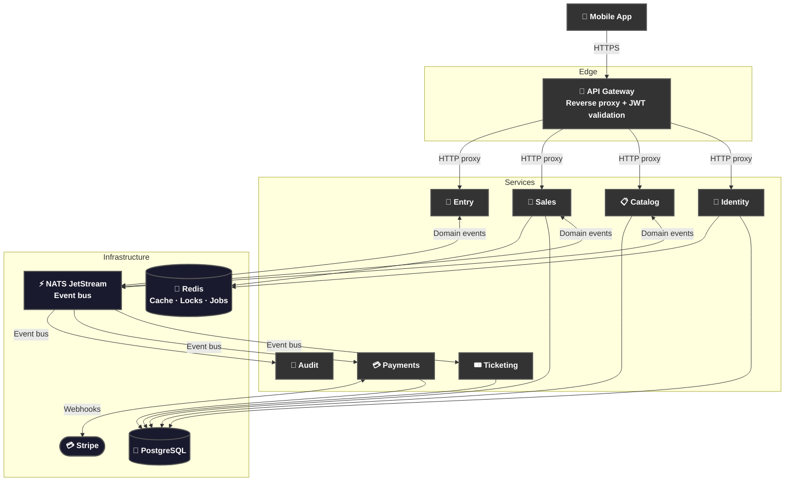

<div align="center">


*Your event, your ticket, your phone.*

</div>

# 📝 **Description**

<div align="center">

***QREW*** is a production-grade **event ticketing platform** built as a native mobile app. Built to make ticket fraud and speculation structurally impossible.

Zero friction. One product. Three roles.

</div>

**What makes it different:**

- 📱 **Native mobile, one codebase.** React and Capacitor deliver a true native experience on Android and iOS with hardware camera access for the built-in QR scanner.
- 🔐 **Secure by design.** Passkey and TOTP authentication, ES256 JWT signing, PII encrypted at rest with Fernet, and a gateway that validates every request before it reaches a service.
- 🎟️ **Live market and waitlists.** When an event sells out, buyers join an automated waitlist. When a ticket is listed for resale, the next person in line gets it first.
- ⚡ **Event-driven microservices.** Seven independent services communicate over NATS JetStream — no shared databases, no synchronous service calls, clean domain boundaries and at-least-once delivery.

# 🏗️ **Architecture**

<div align="center">



</div>

# 📁 **Project Structure**

```
QREW/
├── README.md                          # You are here! ⬅️
├── ARCHITECTURE.md                    # System architecture deep-dive
├── CONTRIBUTING.md                    # Contribution guidelines
├── SECURITY.md                        # Security policy
├── CHANGELOG.md                       # Release history
├── LICENSE                            # MIT License
├── docker-compose.yml                 # Full local stack
├── Justfile                           # Dev task runner
│
├── apps/
│   ├── app/                           # React + Capacitor mobile app
│   │   ├── src/
│   │   │   ├── routes/                # TanStack Router pages
│   │   │   ├── features/              # Feature modules (organiser, scanner…)
│   │   │   ├── components/            # Shared UI components
│   │   │   └── lib/                   # Utilities, query keys, i18n
│   │   ├── android/                   # Android native project
│   │   └── ios/                       # iOS native project
│   │
│   └── api/
│       ├── gateway/                   # Starlette API gateway (:8000)
│       └── services/
│           ├── identity/              # Auth, users, passkeys, TOTP, KYC
│           ├── catalog/               # Events, venues, organisations
│           ├── sales/                 # Reservations, resale market, queue
│           ├── ticketing/             # Tickets, QR tokens
│           ├── payments/              # Stripe webhooks + disbursements
│           ├── entry/                 # Scanner auth, QR validation
│           └── audit/                 # Immutable audit log
│
├── packages/
│   ├── contracts/                     # Shared API contracts (OpenAPI)
│   ├── shared-python/                 # Shared Python utilities
│   └── shared-ts/                     # Shared TypeScript types
│
└── docs/
    ├── app/                           # Frontend docs
    ├── api/                           # API & service docs
    └── development/                   # Local setup guides
```

# 🔧 **Installation**

## 📋 Requirements

- **Docker** and **Docker Compose**
- **Node.js 20+** and **npm**
- **Python 3.12+** and **uv**
- **Android Studio** or **Xcode** (For native builds)

## ⚙️ Setup Guides

| Environment | Guide |
|---|---|
| ✅ Prerequisites | [PREREQUISITES.md](docs/development/PREREQUISITES.md) |
| 🔑 Environment variables | [ENVIRONMENT-VARIABLES.md](docs/development/ENVIRONMENT-VARIABLES.md) |
| 🖥️ Local · Native | [LOCAL-DEVELOPMENT.md](docs/development/LOCAL-DEVELOPMENT.md) |
| 🐳 Local · Docker | [DOCKER.md](docs/development/DOCKER.md) |
| 📱 Android · Emulator | [EMULATOR.md](docs/development/EMULATOR.md) |
| 📲 Android · USB | [DEVICE.md](docs/development/DEVICE.md) |

## ⚡ Quick Start

**1. Clone the repository**

```bash
git clone https://github.com/cristiangilsanz/qrew.git
cd qrew
```

**2. Set up the frontend environment**

```bash
cp apps/app/.env.example apps/app/.env
```

Open `apps/app/.env` and fill in:

| Variable | Description |
|---|---|
| `VITE_GOOGLE_MAPS_API_KEY` | Google Maps API key (venue picker) |
| `VITE_STRIPE_PUBLISHABLE_KEY` | Stripe publishable key (checkout) |
| `VITE_TURNSTILE_SITE_KEY` | Cloudflare Turnstile site key (captcha) |
| `VITE_API_URL` | Leave empty in local dev — Vite proxy handles it |
| `VITE_GATEWAY_URL` | Leave empty in local dev — Vite proxy handles it |

**3. Set up the backend environment**

Each service has its own `local.yaml`.

Copy all examples:

```bash
for f in $(find apps/api -name "local.yaml.example"); do cp "$f" "${f%.example}"; done
```

Fill in the required secrets across all the service configuration files:

| Secret | Where | Description |
|---|---|---|
| `access_jwt_private_key` | gateway, all services | ES256 private key for token signing |
| `pii_encryption_key` | identity, payments | Fernet key for PII encryption at rest |
| `stripe_secret_key` | payments | Stripe secret key |
| `stripe_webhook_signing_secret` | payments | Stripe webhook endpoint secret |
| `twilio_account_sid` / `twilio_auth_token` | identity | SMS / OTP delivery (optional in dev) |
| `captcha_secret_key` | identity | Cloudflare Turnstile secret (optional in dev) |
| `storage_signing_key` | identity | Key for signed storage URLs |

> Most secrets can be left empty for local dev. Features that need them are disabled by default via their `*_enabled: false` flags.

**4. Spin up the full stack**

```bash
docker compose up
```

Once running, the following services will be available locally:

| Service | URL |
|---|---|
| Mobile app | `http://localhost:5173` |
| API gateway | `http://localhost:8000` |

# 📚 **Tech Stack**

## 🗣️ Languages

- **[Python 3.12](https://www.python.org/)** — Backend services · API gateway
- **[TypeScript 5](https://www.typescriptlang.org/)** — Mobile app

## 🧩 Frameworks & Libraries

- **[React](https://react.dev/)** — UI framework
- **[FastAPI](https://fastapi.tiangolo.com/)** — Backend REST services
- **[Starlette](https://www.starlette.io/)** — API gateway
- **[Capacitor](https://capacitorjs.com/)** — Native mobile runtime (Android · iOS)
- **[TanStack Router](https://tanstack.com/router)** — Client-side routing
- **[TanStack Query](https://tanstack.com/query)** — Server state & data fetching
- **[SQLAlchemy](https://docs.sqlalchemy.org/)** — ORM
- **[Alembic](https://alembic.sqlalchemy.org/)** — Database migrations
- **[Tailwind CSS](https://tailwindcss.com/)** — Utility-first styling
- **[shadcn/ui](https://ui.shadcn.com/)** — Component library
- **[Framer Motion](https://www.framer.com/motion/)** — Animations
- **[react-i18next](https://react.i18next.com/)** — Internationalisation

## 🗄️ Databases & Storage

- **[PostgreSQL](https://www.postgresql.org/)** — Primary relational database
- **[Redis](https://redis.io/)** — Cache · distributed locks · job queues
- **[Cloudflare R2](https://developers.cloudflare.com/r2/)** — Object storage

## ⚡ Messaging & Background Jobs

- **[NATS JetStream](https://docs.nats.io/nats-concepts/jetstream)** — Event bus · at-least-once delivery
- **[Arq](https://arq-docs.helpmanual.io/)** — Async background job runner
- **[Redlock](https://redis.io/docs/latest/develop/use/patterns/distributed-locks/)** — Distributed locking

## 🔐 Security & Auth

- **JWT ES256** — Asymmetric token signing
- **[WebAuthn](https://webauthn.io/)** — Passkey authentication
- **TOTP** — Two-factor authentication
- **Argon2** — Password hashing
- **Fernet** — PII encryption at rest

## 💳 Third-party Services

- **[Stripe](https://stripe.com/docs)** — Payments & webhooks
- **[Resend](https://resend.com/docs)** — Transactional email
- **[Twilio](https://www.twilio.com/docs)** — SMS · OTP delivery
- **[Cloudflare Turnstile](https://developers.cloudflare.com/turnstile/)** — Bot protection

## 🧪 Testing

- **[Vitest](https://vitest.dev/)** — Frontend unit testing
- **[React Testing Library](https://testing-library.com/)** — Component testing
- **[pytest](https://docs.pytest.org/)** — Backend unit & integration testing
- **[MSW](https://mswjs.io/)** — API mocking

## 🔍 Code Quality

- **[Ruff](https://docs.astral.sh/ruff/)** — Python linting + formatting
- **[Pyright](https://github.com/microsoft/pyright)** — Python type checking
- **[ESLint](https://eslint.org/)** — TypeScript linting
- **[Prettier](https://prettier.io/)** — TypeScript formatting

# 📖 **Documentation**

| Topic | Link |
|---|---|
| 🏗️ Architecture | [ARCHITECTURE.md](ARCHITECTURE.md) |
| 🗺️ App routing | [docs/app/ROUTING.md](docs/app/ROUTING.md) |
| 🧩 Components | [docs/app/COMPONENTS.md](docs/app/COMPONENTS.md) |
| 🌍 Internationalisation | [docs/app/I18N.md](docs/app/I18N.md) |
| 📦 State management | [docs/app/STATE-MANAGEMENT.md](docs/app/STATE-MANAGEMENT.md) |
| 📱 Capacitor setup | [docs/app/CAPACITOR.md](docs/app/CAPACITOR.md) |
| 🔌 API services | [docs/api/](docs/api/) |
| ⚡ NATS streams | [docs/api/streams.md](docs/api/streams.md) |
| 🤝 Contributing | [CONTRIBUTING.md](CONTRIBUTING.md) |
| 🔒 Security | [SECURITY.md](SECURITY.md) |
| 📋 Changelog | [CHANGELOG.md](CHANGELOG.md) |

# 🙏 **Credits & Thanks**

Built with incredible open-source tools — thanks to the teams behind [FastAPI](https://fastapi.tiangolo.com/), [TanStack](https://tanstack.com/), [Capacitor](https://capacitorjs.com/), [NATS](https://nats.io/), and [Stripe](https://stripe.com/) for making a project like this possible.

# 📄 **License**

This project is licensed under the MIT License — see the [LICENSE](LICENSE) file for details.

# 📞 **Get Help & Connect**

- 💬 [Start a discussion](https://github.com/cristiangilsanz/qrew/discussions)
- 🐛 [Open an issue](https://github.com/cristiangilsanz/qrew/issues)
- 📧 cristiangilsanz@gmail.com

<div align="center">
  <br>

  **Made with 💖 for the community**

  ⭐ [Star this repo](https://github.com/cristiangilsanz/qrew) · 🍴 [Fork it](https://github.com/cristiangilsanz/qrew/fork)

  <br>

  [](https://www.buymeacoffee.com/cristiangilsanz)

</div>
