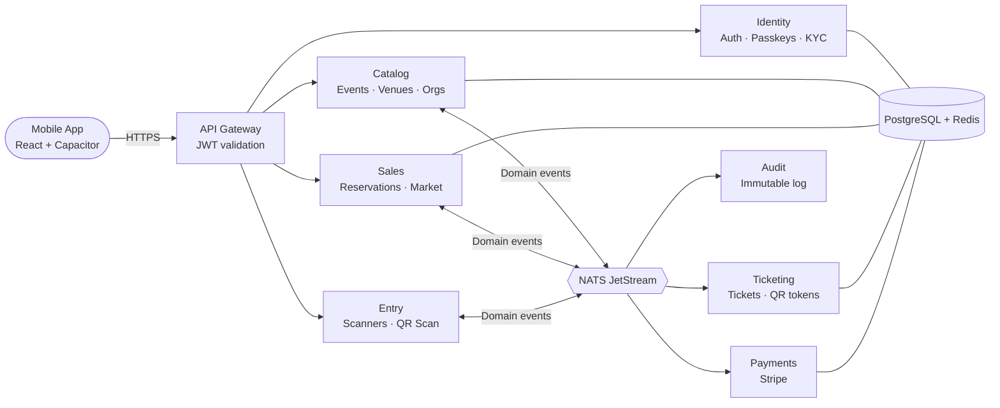

```
  ██████╗ ██████╗ ███████╗██╗    ██╗
 ██╔═══██╗██╔══██╗██╔════╝██║    ██║
 ██║   ██║██████╔╝█████╗  ██║ █╗ ██║
 ██║▄▄ ██║██╔══██╗██╔══╝  ██║███╗██║
 ╚██████╔╝██║  ██║███████╗╚███╔███╔╝
  ╚══▀▀═╝ ╚═╝  ╚═╝╚══════╝ ╚══╝╚══╝
```

<div align="center">

**Event ticketing, reinvented for mobile.**


</div>

---

qrew is a production-grade event ticketing platform built as a native mobile app. Attendees buy and resell tickets. Organisers run events end to end. Entry staff scan QR codes at the gate. One product, three roles, zero friction.

---

## What makes it different

**Native mobile, one codebase.** React and Capacitor deliver a true native experience on Android and iOS, with hardware camera access for the built-in QR scanner.

**Secure by design.** Passkey and TOTP authentication, ES256 JWT signing, PII encrypted at rest with Fernet, and a gateway that validates every request before it reaches a service.

**Live market and waitlists.** When an event sells out, buyers join an automated waitlist. When a ticket is listed for resale, the next person in line gets it first.

**Event-driven microservices.** Seven independent services communicate over NATS JetStream. No shared databases, no synchronous service calls. Just clean domain boundaries and at least once event delivery.

---

## How it works



---

## Stack

| Layer | Technology |
|---|---|
| Mobile app | React 18, TanStack Router, TanStack Query, Tailwind CSS |
| Native runtime | Capacitor, Android, iOS |
| API gateway | Python, Starlette |
| Backend services | Python, FastAPI, SQLAlchemy, Alembic |
| Auth | JWT ES256, WebAuthn passkeys, TOTP, Argon2 |
| Messaging | NATS JetStream |
| Data | PostgreSQL 16, Redis |
| Payments | Stripe |
| Background jobs | Arq, Redlock |

---

## Documentation

| | |
|---|---|
| Architecture | [ARCHITECTURE.md](ARCHITECTURE.md) |
| Getting started | [docs/development/](docs/development/) |
| App | [docs/app/](docs/app/) |
| API | [docs/api/](docs/api/) |
| Contributing | [CONTRIBUTING.md](CONTRIBUTING.md) |
| Security | [SECURITY.md](SECURITY.md) |
| Changelog | [CHANGELOG.md](CHANGELOG.md) |

---

*Private repository. All rights reserved.*
