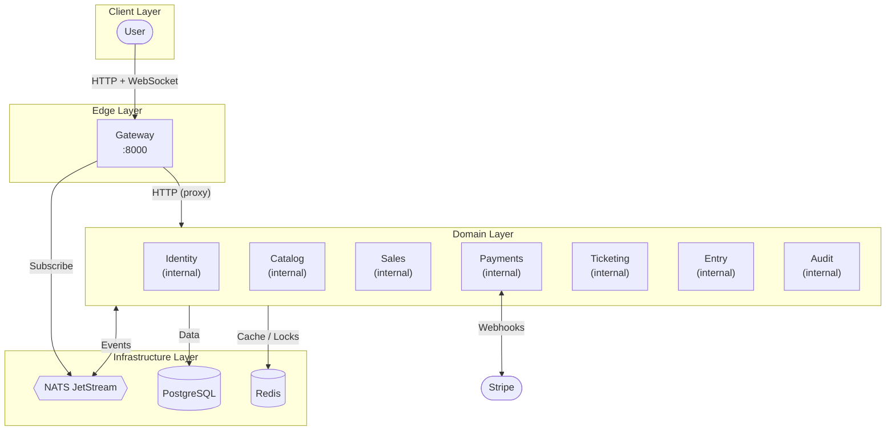
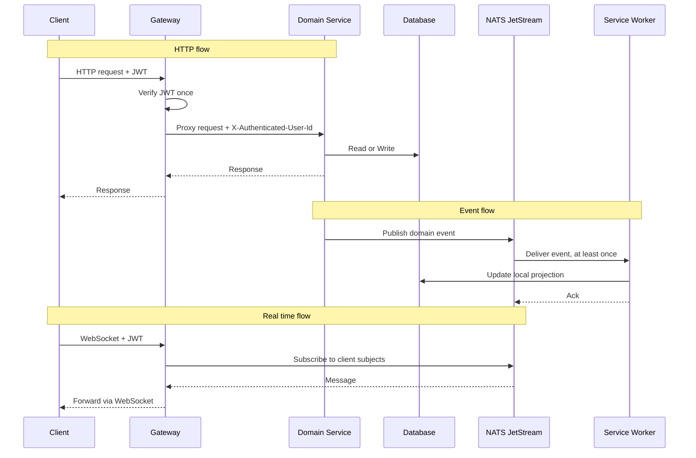

# Overview

## Introduction

Qrew follows an event-driven microservices architecture organised into four layers, where each service is structured internally as a layered application separating transport, domain logic, and data access.

1. **Client Layer.** Represents the external consumers of the platform.
2. **Edge Layer.** Represents the real time entry point that authenticates clients and bridges them to internal event streams.
3. **Domain Layer.** Represents the business logic of the platform.
4. **Infrastructure Layer.** Represents the shared primitives all services depend on.

Stripe is the only external third-party dependency and is integrated exclusively through the Payments service.

## Layout

The following diagram shows how the system is organised across all four layers and how each component relates to the others.

## Communication

The platform operates through three communication channels, each serving a distinct purpose.

* **HTTP flow.** Used by clients for all data operations such as authentication, browsing the catalog, purchasing tickets, and scanning at the gate.
* **Event flow.** Used by services to propagate state changes across the platform.
* **Real time flow.** Used by clients to receive live push updates without polling.

The following diagram shows how clients, services, and infrastructure interact across these three flows.

