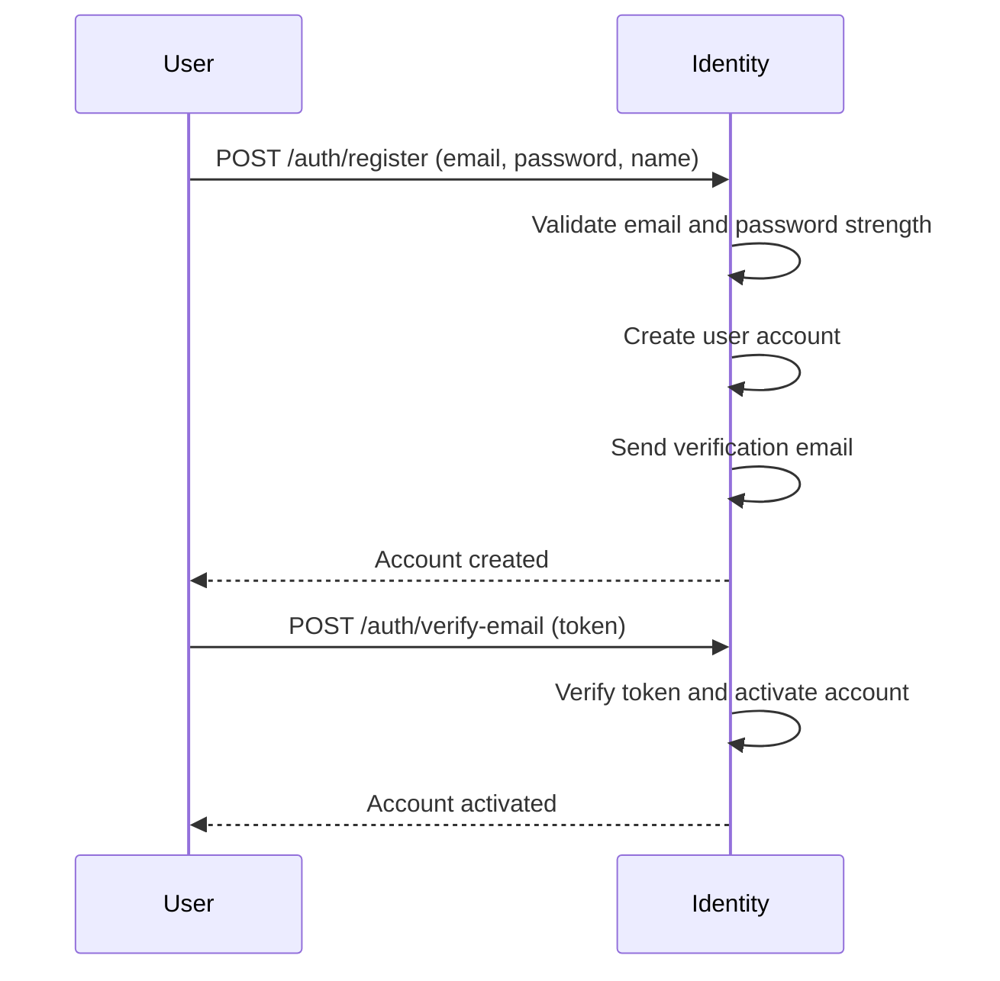

# UC01 — User Registration

```mermaid
sequenceDiagram
    participant U as User
    participant ID as Identity

    U->>ID: POST /auth/register (email, password, name)
    ID->>ID: Validate email and password strength
    ID->>ID: Create user account
    ID->>ID: Send verification email
    ID-->>U: Account created

    U->>ID: POST /auth/verify-email (token)
    ID->>ID: Verify token and activate account
    ID-->>U: Account activated
```
