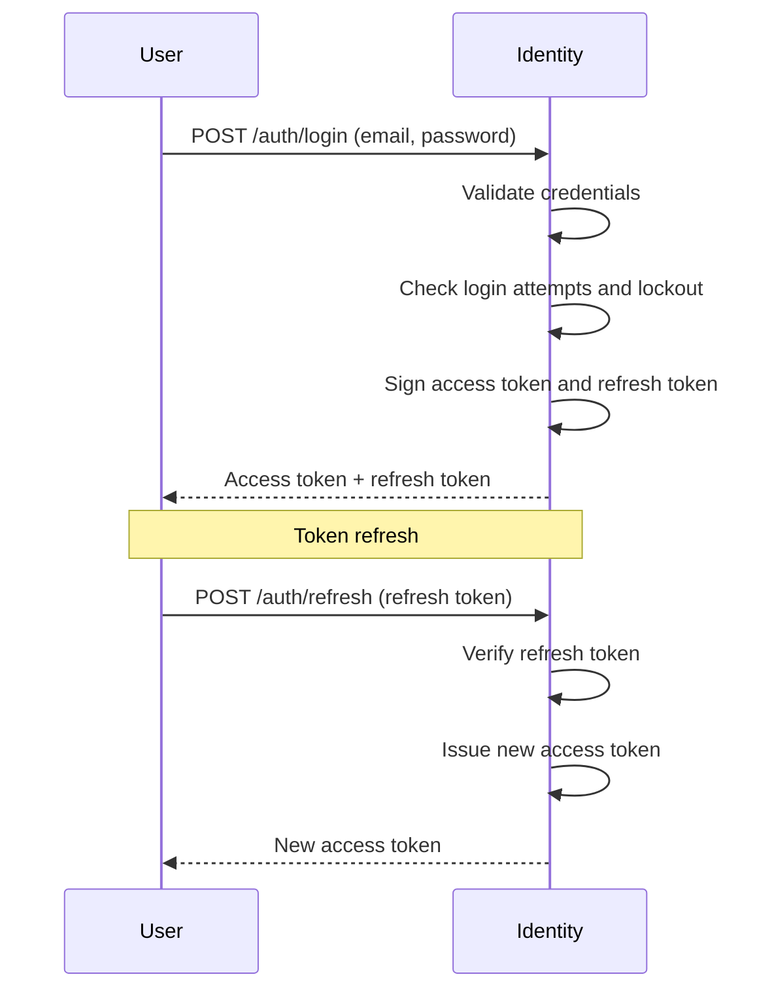

# UC02 — User Login

```mermaid
sequenceDiagram
    participant U as User
    participant ID as Identity

    U->>ID: POST /auth/login (email, password)
    ID->>ID: Validate credentials
    ID->>ID: Check login attempts and lockout
    ID->>ID: Sign access token and refresh token
    ID-->>U: Access token + refresh token

    Note over U,ID: Token refresh

    U->>ID: POST /auth/refresh (refresh token)
    ID->>ID: Verify refresh token
    ID->>ID: Issue new access token
    ID-->>U: New access token
```
