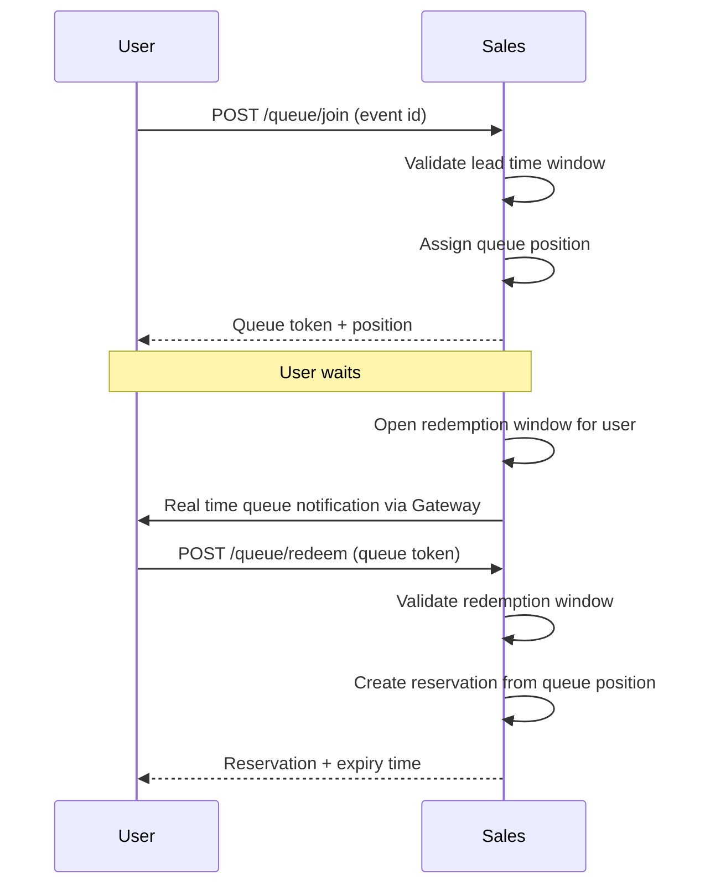

# UC06 — Join Queue

```mermaid
sequenceDiagram
    participant U as User
    participant SAL as Sales

    U->>SAL: POST /queue/join (event id)
    SAL->>SAL: Validate lead time window
    SAL->>SAL: Assign queue position
    SAL-->>U: Queue token + position

    Note over U,SAL: User waits

    SAL->>SAL: Open redemption window for user
    SAL->>U: Real time queue notification via Gateway

    U->>SAL: POST /queue/redeem (queue token)
    SAL->>SAL: Validate redemption window
    SAL->>SAL: Create reservation from queue position
    SAL-->>U: Reservation + expiry time
```
