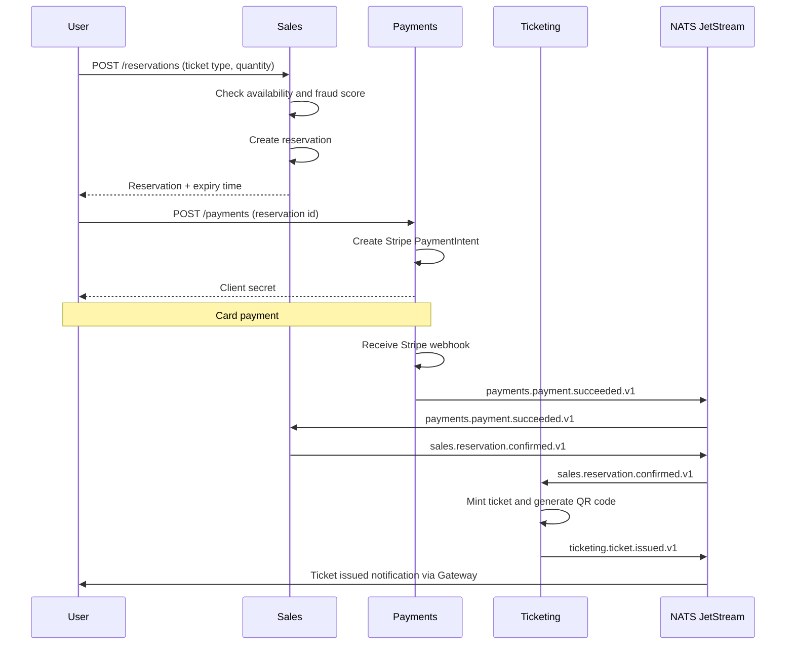

# UC04 — Purchase Ticket

```mermaid
sequenceDiagram
    participant U as User
    participant SAL as Sales
    participant PAY as Payments
    participant TKT as Ticketing
    participant NATS as NATS JetStream

    U->>SAL: POST /reservations (ticket type, quantity)
    SAL->>SAL: Check availability and fraud score
    SAL->>SAL: Create reservation
    SAL-->>U: Reservation + expiry time

    U->>PAY: POST /payments (reservation id)
    PAY->>PAY: Create Stripe PaymentIntent
    PAY-->>U: Client secret

    Note over U,PAY: Card payment

    PAY->>PAY: Receive Stripe webhook
    PAY->>NATS: payments.payment.succeeded.v1

    NATS->>SAL: payments.payment.succeeded.v1
    SAL->>NATS: sales.reservation.confirmed.v1

    NATS->>TKT: sales.reservation.confirmed.v1
    TKT->>TKT: Mint ticket and generate QR code
    TKT->>NATS: ticketing.ticket.issued.v1

    NATS->>U: Ticket issued notification via Gateway
```
