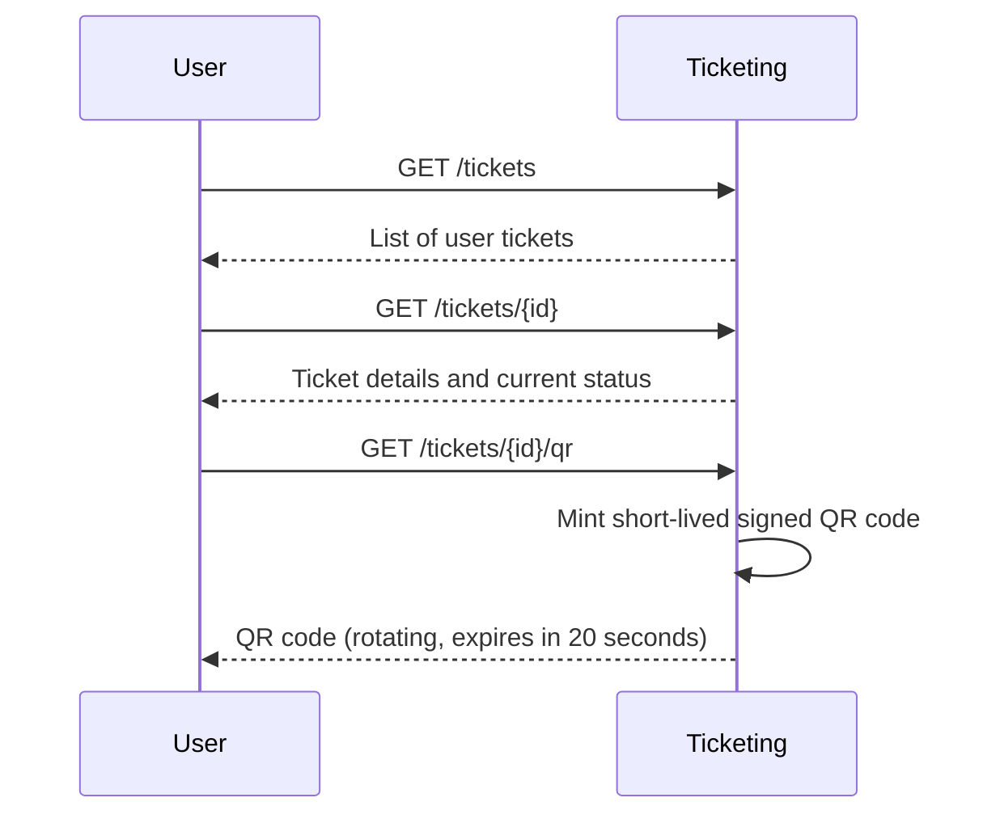

# UC05 — View Tickets

```mermaid
sequenceDiagram
    participant U as User
    participant TKT as Ticketing

    U->>TKT: GET /tickets
    TKT-->>U: List of user tickets

    U->>TKT: GET /tickets/{id}
    TKT-->>U: Ticket details and current status

    U->>TKT: GET /tickets/{id}/qr
    TKT->>TKT: Mint short-lived signed QR code
    TKT-->>U: QR code (rotating, expires in 20 seconds)
```
