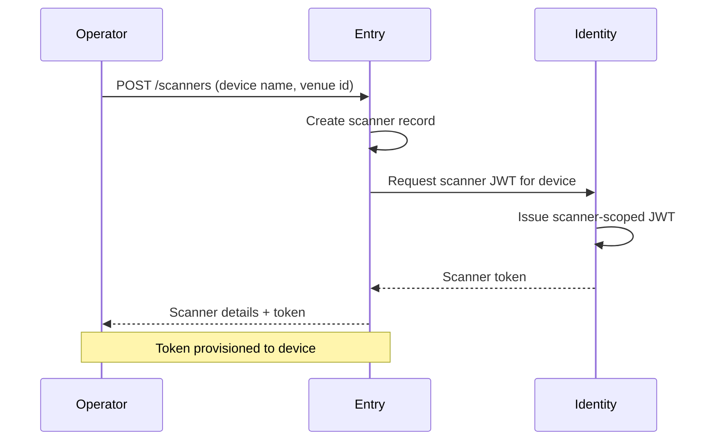

# UC07 — Scanner Registration

```mermaid
sequenceDiagram
    participant OP as Operator
    participant ENT as Entry
    participant ID as Identity

    OP->>ENT: POST /scanners (device name, venue id)
    ENT->>ENT: Create scanner record
    ENT->>ID: Request scanner JWT for device
    ID->>ID: Issue scanner-scoped JWT
    ID-->>ENT: Scanner token
    ENT-->>OP: Scanner details + token

    Note over OP,ENT: Token provisioned to device
```
