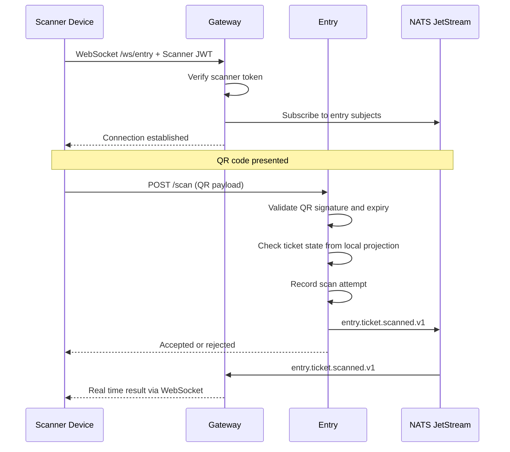

# UC08 — Scan Ticket at Gate

```mermaid
sequenceDiagram
    participant SC as Scanner Device
    participant GW as Gateway
    participant ENT as Entry
    participant NATS as NATS JetStream

    SC->>GW: WebSocket /ws/entry + Scanner JWT
    GW->>GW: Verify scanner token
    GW->>NATS: Subscribe to entry subjects
    GW-->>SC: Connection established

    Note over SC,NATS: QR code presented

    SC->>ENT: POST /scan (QR payload)
    ENT->>ENT: Validate QR signature and expiry
    ENT->>ENT: Check ticket state from local projection
    ENT->>ENT: Record scan attempt
    ENT->>NATS: entry.ticket.scanned.v1
    ENT-->>SC: Accepted or rejected

    NATS->>GW: entry.ticket.scanned.v1
    GW-->>SC: Real time result via WebSocket
```
