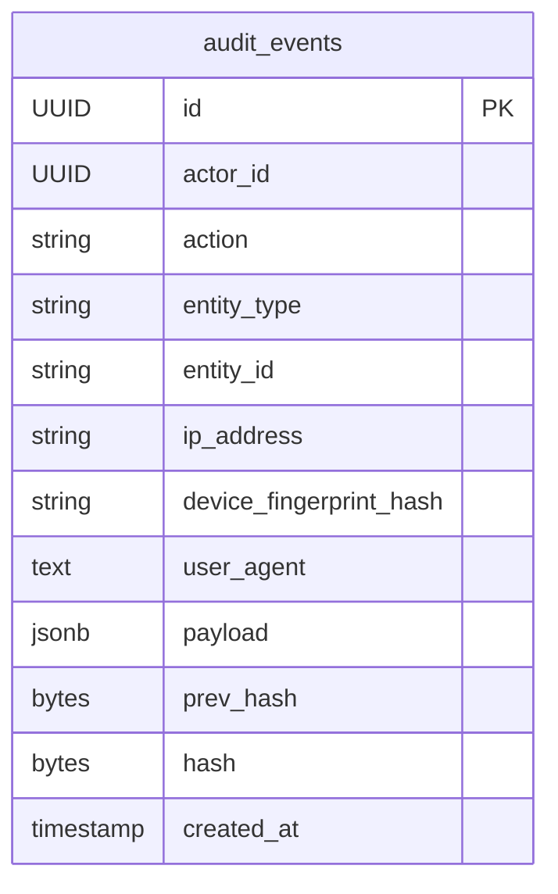

# Audit — Database Schema

```mermaid
erDiagram
    audit_events {
        UUID id PK
        UUID actor_id
        string action
        string entity_type
        string entity_id
        string ip_address
        string device_fingerprint_hash
        text user_agent
        jsonb payload
        bytes prev_hash
        bytes hash
        timestamp created_at
    }
```
