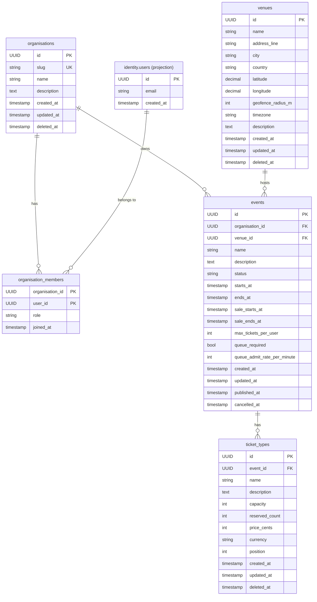

# Catalog — Database Schema

```mermaid
erDiagram
    organisations {
        UUID id PK
        string slug UK
        string name
        text description
        timestamp created_at
        timestamp updated_at
        timestamp deleted_at
    }

    organisation_members {
        UUID organisation_id PK
        UUID user_id PK
        string role
        timestamp joined_at
    }

    venues {
        UUID id PK
        string name
        string address_line
        string city
        string country
        decimal latitude
        decimal longitude
        int geofence_radius_m
        string timezone
        text description
        timestamp created_at
        timestamp updated_at
        timestamp deleted_at
    }

    events {
        UUID id PK
        UUID organisation_id FK
        UUID venue_id FK
        string name
        text description
        string status
        timestamp starts_at
        timestamp ends_at
        timestamp sale_starts_at
        timestamp sale_ends_at
        int max_tickets_per_user
        bool queue_required
        int queue_admit_rate_per_minute
        timestamp created_at
        timestamp updated_at
        timestamp published_at
        timestamp cancelled_at
    }

    ticket_types {
        UUID id PK
        UUID event_id FK
        string name
        text description
        int capacity
        int reserved_count
        int price_cents
        string currency
        int position
        timestamp created_at
        timestamp updated_at
        timestamp deleted_at
    }

    identity_users["identity.users (projection)"] {
        UUID id PK
        string email
        timestamp created_at
    }

    organisations ||--o{ organisation_members : "has"
    organisations ||--o{ events : "owns"
    identity_users ||--o{ organisation_members : "belongs to"
    venues ||--o{ events : "hosts"
    events ||--o{ ticket_types : "has"
```
