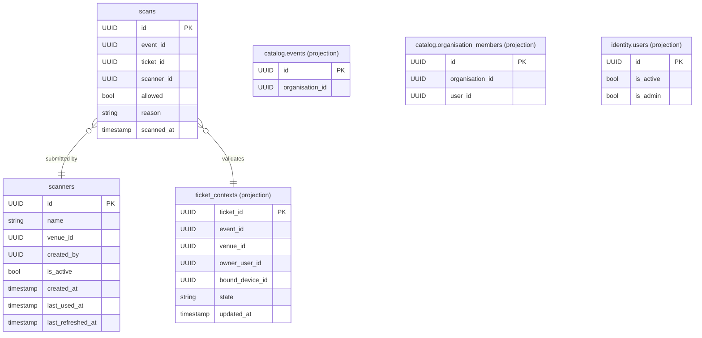

# Entry — Database Schema

```mermaid
erDiagram
    scanners {
        UUID id PK
        string name
        UUID venue_id
        UUID created_by
        bool is_active
        timestamp created_at
        timestamp last_used_at
        timestamp last_refreshed_at
    }

    scans {
        UUID id PK
        UUID event_id
        UUID ticket_id
        UUID scanner_id
        bool allowed
        string reason
        timestamp scanned_at
    }

    ticket_contexts["ticket_contexts (projection)"] {
        UUID ticket_id PK
        UUID event_id
        UUID venue_id
        UUID owner_user_id
        UUID bound_device_id
        string state
        timestamp updated_at
    }

    catalog_events["catalog.events (projection)"] {
        UUID id PK
        UUID organisation_id
    }

    catalog_org_members["catalog.organisation_members (projection)"] {
        UUID id PK
        UUID organisation_id
        UUID user_id
    }

    identity_users["identity.users (projection)"] {
        UUID id PK
        bool is_active
        bool is_admin
    }

    scans }o--|| scanners : "submitted by"
    scans }o--|| ticket_contexts : "validates"
```
