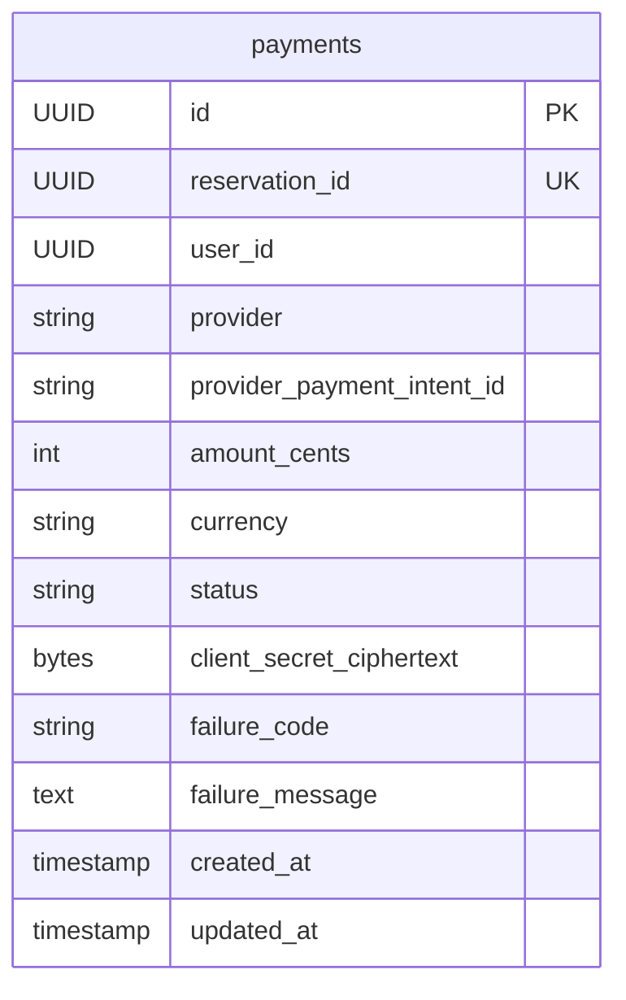

# Payments — Database Schema

```mermaid
erDiagram
    payments {
        UUID id PK
        UUID reservation_id UK
        UUID user_id
        string provider
        string provider_payment_intent_id
        int amount_cents
        string currency
        string status
        bytes client_secret_ciphertext
        string failure_code
        text failure_message
        timestamp created_at
        timestamp updated_at
    }
```
