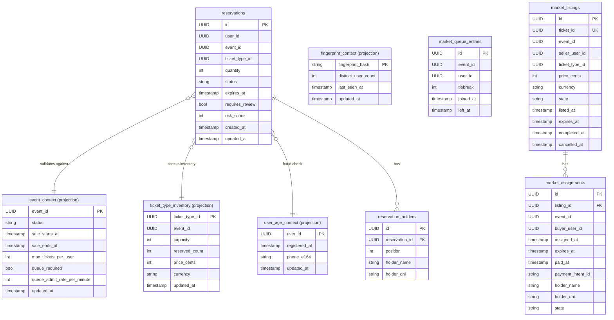

# Sales Database Schema

```mermaid
erDiagram
    reservations {
        UUID id PK
        UUID user_id
        UUID event_id
        UUID ticket_type_id
        int quantity
        string status
        timestamp expires_at
        bool requires_review
        int risk_score
        timestamp created_at
        timestamp updated_at
    }

    event_context["event_context (projection)"] {
        UUID event_id PK
        string status
        timestamp sale_starts_at
        timestamp sale_ends_at
        int max_tickets_per_user
        bool queue_required
        int queue_admit_rate_per_minute
        timestamp updated_at
    }

    ticket_type_inventory["ticket_type_inventory (projection)"] {
        UUID ticket_type_id PK
        UUID event_id
        int capacity
        int reserved_count
        int price_cents
        string currency
        timestamp updated_at
    }

    user_age_context["user_age_context (projection)"] {
        UUID user_id PK
        timestamp registered_at
        string phone_e164
        timestamp updated_at
    }

    fingerprint_context["fingerprint_context (projection)"] {
        string fingerprint_hash PK
        int distinct_user_count
        timestamp last_seen_at
        timestamp updated_at
    }

    reservation_holders {
        UUID id PK
        UUID reservation_id FK
        int position
        string holder_name
        string holder_dni
    }

    market_queue_entries {
        UUID id PK
        UUID event_id
        UUID user_id
        int tiebreak
        timestamp joined_at
        timestamp left_at
    }

    market_listings {
        UUID id PK
        UUID ticket_id UK
        UUID event_id
        UUID seller_user_id
        UUID ticket_type_id
        int price_cents
        string currency
        string state
        timestamp listed_at
        timestamp expires_at
        timestamp completed_at
        timestamp cancelled_at
    }

    market_assignments {
        UUID id PK
        UUID listing_id FK
        UUID event_id
        UUID buyer_user_id
        timestamp assigned_at
        timestamp expires_at
        timestamp paid_at
        string payment_intent_id
        string holder_name
        string holder_dni
        string state
    }

    reservations }o--|| event_context : "validates against"
    reservations }o--|| ticket_type_inventory : "checks inventory"
    reservations }o--|| user_age_context : "fraud check"
    reservations ||--o{ reservation_holders : "has"
    market_listings ||--o{ market_assignments : "has"
```
