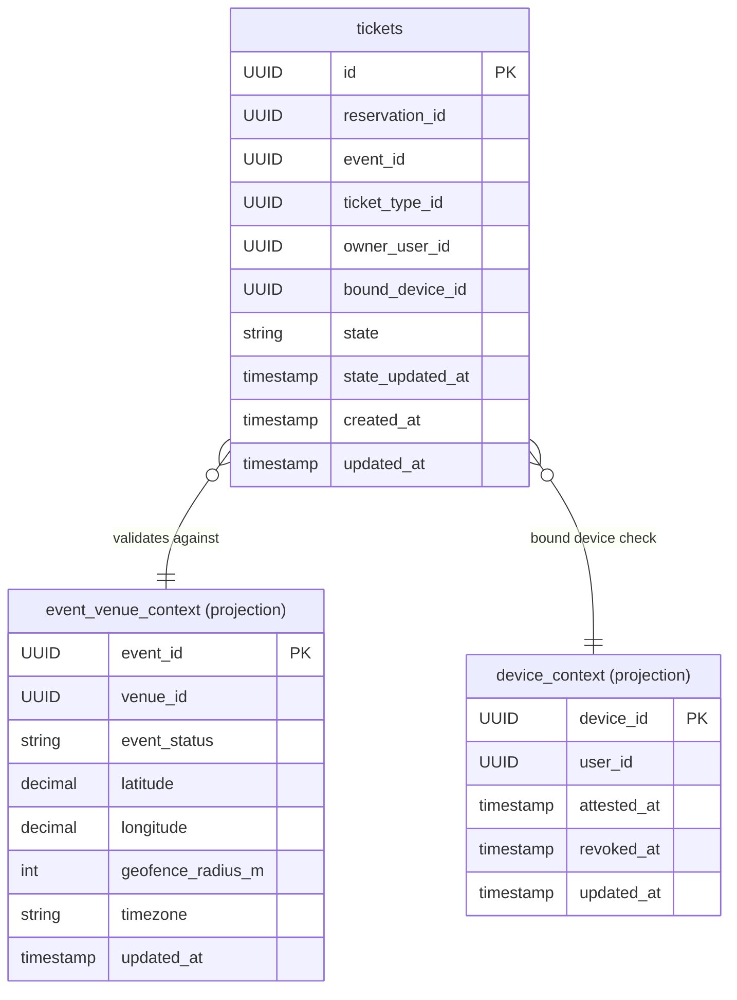

# Ticketing — Database Schema

```mermaid
erDiagram
    tickets {
        UUID id PK
        UUID reservation_id
        UUID event_id
        UUID ticket_type_id
        UUID owner_user_id
        UUID bound_device_id
        string state
        timestamp state_updated_at
        timestamp created_at
        timestamp updated_at
    }

    event_venue_context["event_venue_context (projection)"] {
        UUID event_id PK
        UUID venue_id
        string event_status
        decimal latitude
        decimal longitude
        int geofence_radius_m
        string timezone
        timestamp updated_at
    }

    device_context["device_context (projection)"] {
        UUID device_id PK
        UUID user_id
        timestamp attested_at
        timestamp revoked_at
        timestamp updated_at
    }

    tickets }o--|| event_venue_context : "validates against"
    tickets }o--|| device_context : "bound device check"
```
