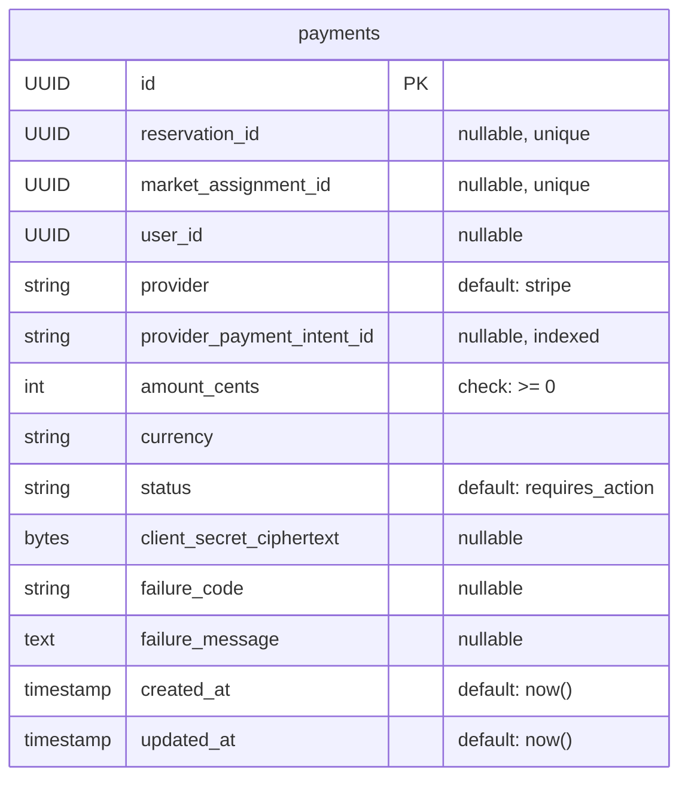

# Payments Database Schema

## Schema: `payments`

### Table: `payments`

| Column | Type | Nullable | Default | Notes |
|---|---|---|---|---|
| `id` | `UUID` | NOT NULL | — | Primary key |
| `reservation_id` | `UUID` | NULL | — | Unique; mutually exclusive with `market_assignment_id` |
| `market_assignment_id` | `UUID` | NULL | — | Unique; mutually exclusive with `reservation_id` |
| `user_id` | `UUID` | NULL | — | |
| `provider` | `VARCHAR(32)` | NOT NULL | `'stripe'` | Payment provider name |
| `provider_payment_intent_id` | `VARCHAR(255)` | NULL | — | Provider-side intent ID |
| `amount_cents` | `INTEGER` | NOT NULL | — | Amount in minor currency units |
| `currency` | `VARCHAR(3)` | NOT NULL | — | ISO 4217 currency code |
| `status` | `VARCHAR(20)` | NOT NULL | `'requires_action'` | Payment status |
| `client_secret_ciphertext` | `BYTEA` | NULL | — | Encrypted Stripe client secret |
| `failure_code` | `VARCHAR(64)` | NULL | — | Provider failure code |
| `failure_message` | `TEXT` | NULL | — | Provider failure message |
| `created_at` | `TIMESTAMPTZ` | NOT NULL | `now()` | |
| `updated_at` | `TIMESTAMPTZ` | NOT NULL | `now()` | |

### Constraints

| Name | Type | Definition |
|---|---|---|
| `payments_pkey` | PRIMARY KEY | `id` |
| `uq_payments_reservation_id` | UNIQUE | `reservation_id` |
| `uq_payments_market_assignment_id` | UNIQUE | `market_assignment_id` |
| `ck_payments_amount` | CHECK | `amount_cents >= 0` |
| `ck_payments_context` | CHECK | `num_nonnulls(reservation_id, market_assignment_id) = 1` |

### Indexes

| Name | Columns |
|---|---|
| `ix_payments_provider_payment_intent_id` | `provider_payment_intent_id` |
| `ix_payments_market_assignment_id` | `market_assignment_id` |
