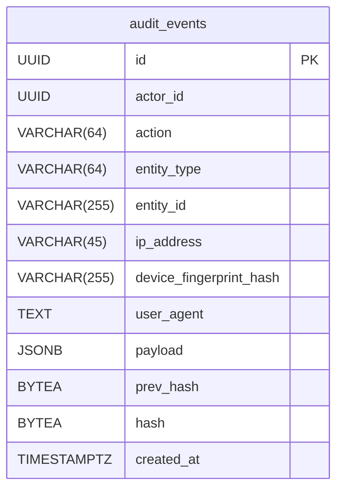

# Audit Database Schema

## Schema: `audit`

### Table: `audit_events`

Append-only tamper-evident log of all auditable actions in the system. Each row is linked to the previous via a cryptographic hash chain (`prev_hash` → `hash`).

| Column | Type | Nullable | Default | Notes |
|---|---|---|---|---|
| `id` | `UUID` | NOT NULL | `gen_random_uuid()` | Primary key |
| `actor_id` | `UUID` | NULL | — | ID of the user or service principal that performed the action |
| `action` | `VARCHAR(64)` | NOT NULL | — | Machine-readable action name, lowercase with underscores (e.g. `register`, `login_failed`, `entry_validated`) |
| `entity_type` | `VARCHAR(64)` | NULL | — | Type of the affected entity (e.g. `user`, `event`) |
| `entity_id` | `VARCHAR(255)` | NULL | — | ID of the affected entity |
| `ip_address` | `VARCHAR(45)` | NULL | — | IPv4 or IPv6 address of the request origin |
| `device_fingerprint_hash` | `VARCHAR(255)` | NULL | — | Hashed device fingerprint |
| `user_agent` | `TEXT` | NULL | — | HTTP User-Agent header |
| `payload` | `JSONB` | NOT NULL | `'{}'` | Arbitrary JSON metadata about the action |
| `prev_hash` | `BYTEA` | NULL | — | Hash of the previous audit event (chain anchor) |
| `hash` | `BYTEA` | NOT NULL | — | Cryptographic hash of this row's content |
| `created_at` | `TIMESTAMPTZ` | NOT NULL | `now()` | Wall-clock timestamp of the event |

### Indexes

| Name | Columns | Type |
|---|---|---|
| `ix_audit_events_actor_id` | `actor_id` | BTREE |
| `ix_audit_events_action` | `action` | BTREE |
| `ix_audit_events_created_at` | `created_at` | BTREE |
