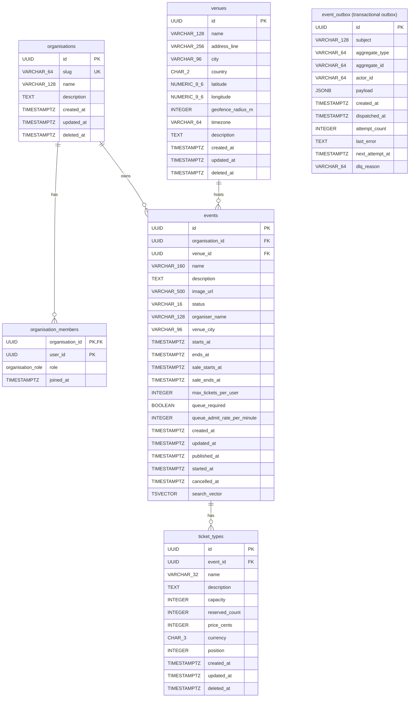

# Catalog Database Schema

## Enum Types

| Type | Values |
|---|---|
| `organisation_role` | `member`, `manager`, `owner` |

## Indexes

| Table | Index Name | Columns | Type |
|---|---|---|---|
| `organisations` | `uq_organisations_slug` | `slug` | UNIQUE |
| `venues` | `ix_venues_city_country` | `city, country` | BTREE |
| `events` | `ix_events_organisation_id` | `organisation_id` | BTREE |
| `events` | `ix_events_venue_id` | `venue_id` | BTREE |
| `events` | `ix_events_status_starts_at` | `status, starts_at` | BTREE |
| `events` | `ix_events_search_vector` | `search_vector` | GIN |
| `ticket_types` | `ix_ticket_types_event_id` | `event_id` | BTREE |
| `event_outbox` | `ix_catalog_event_outbox_pending` | `next_attempt_at` | BTREE, partial `WHERE dispatched_at IS NULL AND dlq_reason IS NULL` |

## Check Constraints

| Table | Constraint Name | Expression |
|---|---|---|
| `events` | `ck_events_time_window` | `starts_at < ends_at` |
| `events` | `ck_events_sale_window` | `sale_starts_at < sale_ends_at` |
| `events` | `ck_events_sale_before_start` | `sale_ends_at <= starts_at` |
| `events` | `ck_events_max_tickets` | `max_tickets_per_user >= 1 AND max_tickets_per_user <= 20` |
| `events` | `ck_events_queue_admit_rate` | `queue_admit_rate_per_minute >= 1 AND queue_admit_rate_per_minute <= 600` |
| `ticket_types` | `uq_ticket_types_event_name` | UNIQUE `(event_id, name)` |
| `ticket_types` | `ck_ticket_types_capacity` | `capacity >= 1 AND capacity <= 100000` |
| `ticket_types` | `ck_ticket_types_reserved` | `reserved_count >= 0 AND reserved_count <= capacity` |
| `ticket_types` | `ck_ticket_types_price` | `price_cents >= 0 AND price_cents <= 10000000` |

## Transactional Outbox

`catalog.event_outbox` holds every domain event the service records inside the transaction that caused it. The `outbox_drainer` job publishes each pending row to NATS and stamps `dispatched_at`. A row that fails is retried with a growing backoff of 5, 15, 60, 300, 900, 1800 and 3600 seconds, and after 8 attempts it is parked with `dlq_reason = 'attempts_exhausted'` instead of retried for ever.

The table and the drainer come from the shared `outbox` package, so catalog, sales, payments, ticketing and identity all use the same columns and the same semantics.
