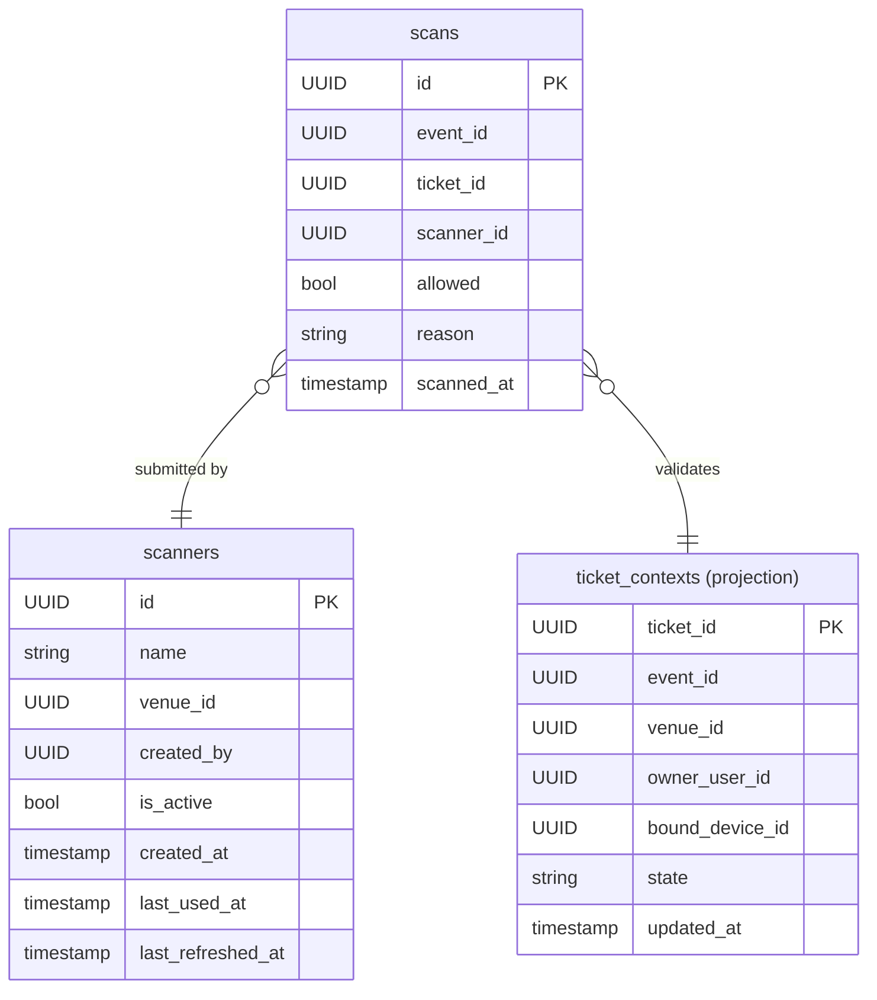

# Entry Database Schema

## Tables

### entry.scanners

Represents a physical or virtual ticket scanner device registered to a venue.

| Column | Type | Nullable | Default | Notes |
|---|---|---|---|---|
| id | UUID | NOT NULL | | PK |
| name | VARCHAR(128) | NOT NULL | | Human-readable scanner name |
| venue_id | UUID | NOT NULL | | References the venue this scanner belongs to |
| created_by | UUID | NOT NULL | | User who registered the scanner |
| created_at | TIMESTAMPTZ | NOT NULL | now() | |
| last_used_at | TIMESTAMPTZ | NULL | | Last time a scan was submitted |
| last_refreshed_at | TIMESTAMPTZ | NULL | | Last time the scanner refreshed its auth token |
| is_active | BOOLEAN | NOT NULL | true | Soft-disable flag |

**Indexes**
- `ix_entry_scanners_venue_id` on `(venue_id)`
- `ix_entry_scanners_created_by` on `(created_by)`

---

### entry.ticket_contexts

Read-model projection of a ticket's current state, maintained by consuming ticketing domain events. Used during scan validation to avoid cross-service queries at scan time.

| Column | Type | Nullable | Default | Notes |
|---|---|---|---|---|
| ticket_id | UUID | NOT NULL | | PK |
| event_id | UUID | NOT NULL | | Event the ticket is for |
| venue_id | UUID | NULL | | Venue resolved from the event |
| owner_user_id | UUID | NULL | | Current ticket owner |
| bound_device_id | UUID | NULL | | Device the ticket is bound to (if any) |
| state | VARCHAR(32) | NOT NULL | | Ticket state (e.g. `valid`, `used`, `cancelled`) |
| updated_at | TIMESTAMPTZ | NOT NULL | now() | Last projection update time |

**Indexes**
- `ix_entry_ticket_contexts_event_id` on `(event_id)`
- `ix_entry_ticket_contexts_state` on `(state)`

---

### entry.scans

Immutable log of every scan attempt, regardless of outcome.

| Column | Type | Nullable | Default | Notes |
|---|---|---|---|---|
| id | UUID | NOT NULL | | PK |
| event_id | UUID | NOT NULL | | Event context for the scan |
| ticket_id | UUID | NULL | | Ticket scanned (NULL if barcode was unrecognised) |
| scanner_id | UUID | NOT NULL | | Scanner that submitted the attempt |
| allowed | BOOLEAN | NOT NULL | | Whether entry was granted |
| reason | VARCHAR(32) | NULL | | Denial reason code when allowed = false |
| scanned_at | TIMESTAMPTZ | NOT NULL | | Wall-clock time of the scan |

**Indexes**
- `ix_entry_scans_event_id` on `(event_id)`
- `ix_entry_scans_event_scanned_at` on `(event_id, scanned_at)`
