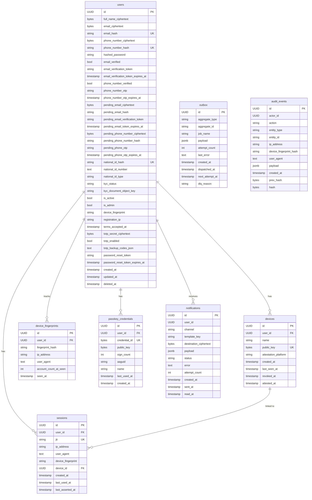

# Identity Database Schema

```mermaid
erDiagram
    users {
        UUID id PK
        bytes full_name_ciphertext
        bytes email_ciphertext
        string email_hash UK
        bytes phone_number_ciphertext
        string phone_number_hash UK
        string hashed_password
        bool email_verified
        string email_verification_token
        timestamp email_verification_token_expires_at
        bool phone_number_verified
        string phone_number_otp
        timestamp phone_number_otp_expires_at
        bytes pending_email_ciphertext
        string pending_email_hash
        string pending_email_verification_token
        timestamp pending_email_token_expires_at
        bytes pending_phone_number_ciphertext
        string pending_phone_number_hash
        string pending_phone_otp
        timestamp pending_phone_otp_expires_at
        string national_id_hash UK
        text national_id_number
        string national_id_type
        string kyc_status
        string kyc_document_object_key
        bool is_active
        bool is_admin
        string device_fingerprint
        string registration_ip
        timestamp terms_accepted_at
        bytes totp_secret_ciphertext
        bool totp_enabled
        text totp_backup_codes_json
        string password_reset_token
        timestamp password_reset_token_expires_at
        timestamp created_at
        timestamp updated_at
        timestamp deleted_at
    }

    sessions {
        UUID id PK
        UUID user_id FK
        string jti UK
        string ip_address
        text user_agent
        string device_fingerprint
        UUID device_id FK
        timestamp created_at
        timestamp last_used_at
        timestamp last_asserted_at
    }

    devices {
        UUID id PK
        UUID user_id FK
        string name
        bytes public_key UK
        string attestation_platform
        timestamp created_at
        timestamp last_seen_at
        timestamp revoked_at
        timestamp attested_at
    }

    device_fingerprints {
        UUID id PK
        UUID user_id FK
        string fingerprint_hash
        string ip_address
        text user_agent
        int account_count_at_seen
        timestamp seen_at
    }

    passkey_credentials {
        UUID id PK
        UUID user_id FK
        bytes credential_id UK
        bytes public_key
        int sign_count
        string aaguid
        string name
        timestamp last_used_at
        timestamp created_at
    }

    notifications {
        UUID id PK
        UUID user_id
        string channel
        string template_key
        bytes destination_ciphertext
        jsonb payload
        string status
        text error
        int attempt_count
        timestamp created_at
        timestamp sent_at
        timestamp read_at
    }

    outbox {
        UUID id PK
        string aggregate_type
        string aggregate_id
        string job_name
        jsonb payload
        int attempt_count
        text last_error
        timestamp created_at
        timestamp dispatched_at
        timestamp next_attempt_at
        string dlq_reason
    }

    audit_events {
        UUID id PK
        UUID actor_id
        string action
        string entity_type
        string entity_id
        string ip_address
        string device_fingerprint_hash
        text user_agent
        jsonb payload
        timestamp created_at
        bytes prev_hash
        bytes hash
    }

    users ||--o{ sessions : "has"
    users ||--o{ devices : "has"
    users ||--o{ device_fingerprints : "tracks"
    users ||--o{ passkey_credentials : "has"
    users ||--o{ notifications : "receives"
    devices ||--o{ sessions : "linked to"
```
