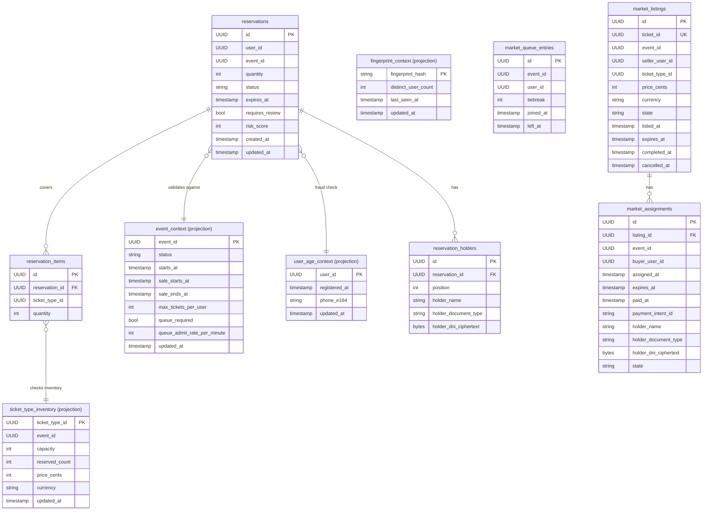

# Sales Database Schema

## Tables

### reservations

Primary sales table. Holds an in-flight reservation for a user on an event. The ticket types it covers live in `reservation_items`, so one reservation may span several tiers.

| Column | Type | Nullable | Default | Notes |
|---|---|---|---|---|
| id | UUID | NO | gen_random_uuid() | PK |
| user_id | UUID | NO | | |
| event_id | UUID | NO | | |
| quantity | INTEGER | NO | | Total across every tier, CHECK quantity >= 1 |
| status | VARCHAR(16) | NO | 'reserved' | |
| expires_at | TIMESTAMPTZ | NO | | |
| requires_review | BOOLEAN | NO | false | |
| risk_score | INTEGER | NO | 0 | |
| created_at | TIMESTAMPTZ | NO | now() | |
| updated_at | TIMESTAMPTZ | NO | now() | |

**Indexes:** `ix_reservations_user_id`, `ix_reservations_event_id`, `ix_reservations_status_expires_at (status, expires_at)`

---

### reservation_items

One row per ticket type a reservation covers. Every tier is locked before any of them is drawn down, so a reservation is either granted in full or not at all.

| Column | Type | Nullable | Default | Notes |
|---|---|---|---|---|
| id | UUID | NO | gen_random_uuid() | PK |
| reservation_id | UUID | NO | | FK to reservations |
| ticket_type_id | UUID | NO | | |
| quantity | INTEGER | NO | | CHECK quantity >= 1 |

**Constraints:** `uq_reservation_items_reservation_tier (reservation_id, ticket_type_id)`

**Indexes:** `ix_reservation_items_reservation_id`

---

### event_context  _(projection)_

Read-model projection of event sale configuration consumed by the sales service.

| Column | Type | Nullable | Default | Notes |
|---|---|---|---|---|
| event_id | UUID | NO | | PK |
| status | VARCHAR(32) | NO | | |
| starts_at | TIMESTAMPTZ | YES | | |
| sale_starts_at | TIMESTAMPTZ | YES | | |
| sale_ends_at | TIMESTAMPTZ | YES | | |
| max_tickets_per_user | INTEGER | NO | 10 | |
| queue_required | BOOLEAN | NO | false | |
| queue_admit_rate_per_minute | INTEGER | NO | 50 | |
| updated_at | TIMESTAMPTZ | NO | now() | |

---

### ticket_type_inventory  _(projection)_

Read-model projection of per-ticket-type inventory counts.

| Column | Type | Nullable | Default | Notes |
|---|---|---|---|---|
| ticket_type_id | UUID | NO | | PK |
| event_id | UUID | NO | | |
| capacity | INTEGER | NO | | |
| reserved_count | INTEGER | NO | 0 | |
| price_cents | INTEGER | NO | 0 | |
| currency | VARCHAR(3) | NO | 'EUR' | |
| updated_at | TIMESTAMPTZ | NO | now() | |

**Indexes:** `ix_ticket_type_inventory_event_id`

---

### user_age_context  _(projection)_

Read-model projection used for fraud and age-gate checks.

| Column | Type | Nullable | Default | Notes |
|---|---|---|---|---|
| user_id | UUID | NO | | PK |
| registered_at | TIMESTAMPTZ | NO | | |
| phone_e164 | VARCHAR(32) | YES | | |
| updated_at | TIMESTAMPTZ | NO | now() | |

---

### fingerprint_context  _(projection)_

Read-model projection tracking device fingerprint reuse across user accounts.

| Column | Type | Nullable | Default | Notes |
|---|---|---|---|---|
| fingerprint_hash | VARCHAR(128) | NO | | PK |
| distinct_user_count | INTEGER | NO | 1 | |
| last_seen_at | TIMESTAMPTZ | NO | | |
| updated_at | TIMESTAMPTZ | NO | now() | |

---

### reservation_holders

Per-ticket holder details attached to a reservation (one row per ticket in the quantity).

| Column | Type | Nullable | Default | Notes |
|---|---|---|---|---|
| id | UUID | NO | gen_random_uuid() | PK |
| reservation_id | UUID | NO | | |
| position | INTEGER | NO | | CHECK position >= 1 |
| holder_name | VARCHAR(255) | NO | | |
| holder_document_type | VARCHAR(16) | NO | 'dni' | dni / nie / other |
| holder_dni_ciphertext | BYTEA | NO | | Fernet ciphertext, read through the `holder_dni` property |

**Constraints:** `ck_reservation_holders_position (position >= 1)`, `uq_reservation_holders_reservation_position (reservation_id, position)`

**Indexes:** `ix_reservation_holders_reservation_id`

---

### market_queue_entries

Queue of users waiting to purchase a resale listing for a given event.

| Column | Type | Nullable | Default | Notes |
|---|---|---|---|---|
| id | UUID | NO | gen_random_uuid() | PK |
| event_id | UUID | NO | | |
| user_id | UUID | NO | | |
| tiebreak | INTEGER | NO | 0 | |
| joined_at | TIMESTAMPTZ | NO | now() | |
| left_at | TIMESTAMPTZ | YES | | NULL = still active |

**Indexes:**
- `ix_market_queue_entries_event_id_active` — partial on `(event_id)` WHERE `left_at IS NULL`
- `ix_market_queue_entries_user_id`
- `uq_market_queue_entries_active_event_user` — **unique** partial on `(event_id, user_id)` WHERE `left_at IS NULL` (allows re-join after leaving)

---

### market_listings

A ticket offered for resale by its original owner.

| Column | Type | Nullable | Default | Notes |
|---|---|---|---|---|
| id | UUID | NO | gen_random_uuid() | PK |
| ticket_id | UUID | NO | | UNIQUE |
| event_id | UUID | NO | | |
| seller_user_id | UUID | NO | | |
| ticket_type_id | UUID | NO | | |
| price_cents | INTEGER | NO | | CHECK >= 0 |
| currency | VARCHAR(3) | NO | 'EUR' | |
| state | VARCHAR(32) | NO | 'available' | available / assigned / completed / cancelled |
| listed_at | TIMESTAMPTZ | NO | now() | |
| expires_at | TIMESTAMPTZ | NO | | |
| completed_at | TIMESTAMPTZ | YES | | |
| cancelled_at | TIMESTAMPTZ | YES | | |

**Constraints:** `ck_market_listings_price (price_cents >= 0)`, `ck_market_listings_state`

**Indexes:**
- `ix_market_listings_event_id_state (event_id, state)`
- `ix_market_listings_seller_user_id`
- `ix_market_listings_expires_at_state` — partial on `(expires_at, state)` WHERE `state IN ('available', 'assigned')`

---

### market_assignments

A buyer's pending or completed purchase of a resale listing.

| Column | Type | Nullable | Default | Notes |
|---|---|---|---|---|
| id | UUID | NO | gen_random_uuid() | PK |
| listing_id | UUID | NO | | FK -> market_listings.id |
| event_id | UUID | NO | | |
| buyer_user_id | UUID | NO | | |
| assigned_at | TIMESTAMPTZ | NO | now() | |
| expires_at | TIMESTAMPTZ | NO | | |
| paid_at | TIMESTAMPTZ | YES | | |
| payment_intent_id | VARCHAR(255) | YES | | |
| holder_name | VARCHAR(255) | YES | | |
| holder_document_type | VARCHAR(16) | YES | | dni / nie / other |
| holder_dni_ciphertext | BYTEA | YES | | Fernet ciphertext, read through the `holder_dni` property |
| state | VARCHAR(32) | NO | 'pending' | pending / paid / expired / declined |

**Constraints:** `ck_market_assignments_state`

**Indexes:**
- `ix_market_assignments_listing_id`
- `ix_market_assignments_buyer_user_id`
- `ix_market_assignments_pending_expires` — partial on `(expires_at)` WHERE `state = 'pending'`
