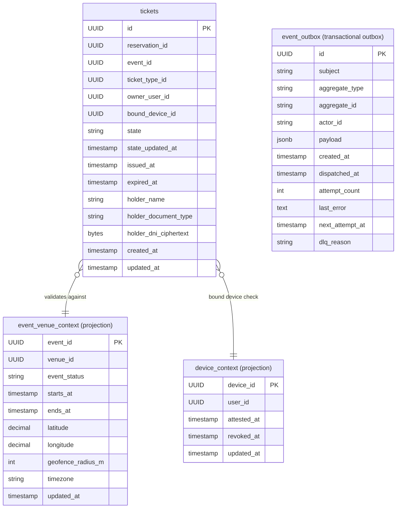

# Ticketing Database Schema

## Table Details

### ticketing.tickets

| Column | Type | Nullable | Default | Notes |
|---|---|---|---|---|
| id | UUID | NOT NULL | gen_random_uuid() | Primary key |
| reservation_id | UUID | NOT NULL | | |
| event_id | UUID | NOT NULL | | |
| ticket_type_id | UUID | NOT NULL | | |
| owner_user_id | UUID | NOT NULL | | |
| bound_device_id | UUID | NULL | | |
| state | VARCHAR(20) | NOT NULL | 'reserved' | e.g. reserved, on_sale, frozen, scanning, redeemed, expired |
| state_updated_at | TIMESTAMPTZ | NULL | | |
| issued_at | TIMESTAMPTZ | NULL | | |
| expired_at | TIMESTAMPTZ | NULL | | |
| holder_name | VARCHAR(255) | NULL | | |
| holder_dni_ciphertext | BYTEA | NULL | | Fernet ciphertext, read through the `holder_dni` property |
| holder_document_type | VARCHAR(16) | NULL | | dni / nie / other |
| created_at | TIMESTAMPTZ | NOT NULL | now() | |
| updated_at | TIMESTAMPTZ | NOT NULL | now() | |

**Indexes:** `ix_tickets_reservation_id`, `ix_tickets_event_id`, `ix_tickets_owner_user_id`, `ix_tickets_state`, `ix_tickets_bound_device_id`

---

### ticketing.event_venue_context

| Column | Type | Nullable | Default | Notes |
|---|---|---|---|---|
| event_id | UUID | NOT NULL | | Primary key |
| venue_id | UUID | NOT NULL | | |
| event_status | VARCHAR(16) | NOT NULL | 'draft' | |
| starts_at | TIMESTAMPTZ | NULL | | |
| ends_at | TIMESTAMPTZ | NULL | | |
| latitude | NUMERIC(9,6) | NOT NULL | 0 | |
| longitude | NUMERIC(9,6) | NOT NULL | 0 | |
| geofence_radius_m | INTEGER | NOT NULL | 200 | |
| timezone | VARCHAR(64) | NOT NULL | 'UTC' | |
| updated_at | TIMESTAMPTZ | NOT NULL | now() | |

---

### ticketing.device_context

| Column | Type | Nullable | Default | Notes |
|---|---|---|---|---|
| device_id | UUID | NOT NULL | | Primary key |
| user_id | UUID | NOT NULL | | |
| attested_at | TIMESTAMPTZ | NULL | | |
| revoked_at | TIMESTAMPTZ | NULL | | |
| updated_at | TIMESTAMPTZ | NOT NULL | now() | |

**Indexes:** `ix_device_context_user_id`

---

### ticketing.event_outbox

Holds every domain event the service records inside the transaction that caused it. The `outbox_drainer` job publishes each pending row to NATS and stamps `dispatched_at`, so no event is lost when the request path cannot reach the broker. The table and the drainer come from the shared `outbox` package.

| Column | Type | Nullable | Default | Notes |
|---|---|---|---|---|
| id | UUID | NOT NULL | gen_random_uuid() | PK |
| subject | VARCHAR(128) | NOT NULL | | NATS subject the row is published to |
| aggregate_type | VARCHAR(64) | NOT NULL | | |
| aggregate_id | VARCHAR(64) | NOT NULL | | |
| actor_id | VARCHAR(64) | NULL | | User the change is attributed to |
| payload | JSONB | NOT NULL | | Event body, becomes `data` in the envelope |
| created_at | TIMESTAMPTZ | NOT NULL | now() | Becomes `occurred_at` in the envelope |
| dispatched_at | TIMESTAMPTZ | NULL | | NULL while the row is still pending |
| attempt_count | INTEGER | NOT NULL | 0 | Parked at 8 attempts |
| last_error | TEXT | NULL | | Repr of the last publish failure |
| next_attempt_at | TIMESTAMPTZ | NOT NULL | now() | Backoff of 5, 15, 60, 300, 900, 1800, 3600 seconds |
| dlq_reason | VARCHAR(64) | NULL | | `attempts_exhausted` once the row is parked |

**Indexes:** `ix_ticketing_event_outbox_pending` — partial on `(next_attempt_at)` WHERE `dispatched_at IS NULL AND dlq_reason IS NULL`
