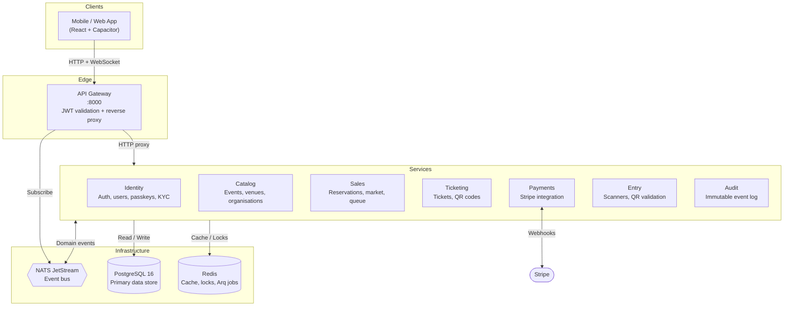

# Architecture

QREW is a mobile-first event ticketing platform built as an event-driven microservice system with a Capacitor mobile frontend.

## System Overview

## Layers

**Client layer.** The React and Capacitor app is the only external consumer. All requests flow through the gateway. No service is directly reachable from outside.

**Edge layer.** The gateway validates JWT tokens on every request and injects `X-Authenticated-User-Id` and `X-Authenticated-User-Is-Admin` headers before proxying to services. Services trust these headers and do not re-verify tokens.

**Domain layer.** Seven independent services, each owning its own PostgreSQL schema and communicating with other services exclusively via NATS JetStream events. No direct service-to-service HTTP calls.

**Infrastructure layer.** PostgreSQL for persistence, NATS JetStream for at-least-once event delivery, Redis for distributed locks via Redlock, rate-limit counters, and background job queues via Arq.

## Communication Patterns

| Pattern | Transport | Used for |
|---|---|---|
| Request/response | HTTP via gateway | All client-initiated operations |
| Domain events | NATS JetStream | State propagation between services |
| Real-time push | WebSocket via gateway | Queue position updates, live notifications |
| Background jobs | Redis + Arq | Scheduled tasks: email, cleanup, token rotation |

## Auth Model

- Tokens are signed with ES256 asymmetric signing. The identity service signs. All other services only verify.
- The gateway decodes the token once and forwards the user identity as trusted headers. Services never see raw tokens.
- Access tokens carry an `adm` claim for admin users, propagated as `X-Authenticated-User-Is-Admin: 1`.
- Scanner tokens are a separate token type issued by the entry service, validated independently by the gateway.

## Service Responsibilities

| Service | Owns | Key rules |
|---|---|---|
| **Identity** | Users, sessions, passkeys, KYC, TOTP | PII encrypted at rest with Fernet. Passwords hashed with Argon2. |
| **Catalog** | Events, venues, organisations, ticket types | Org creation requires `is_admin`. Ongoing events are immutable. |
| **Sales** | Reservations, market listings, queue | Per-user ticket limits enforced server-side. Market 24h cutoff enforced server-side. |
| **Ticketing** | Tickets, QR tokens | Tickets are issued from paid reservations via NATS event. |
| **Payments** | Payment intents, Stripe webhooks | Stripe is the only external dependency. |
| **Entry** | Scanners, scan records | QR scanning only permitted for ongoing events. |
| **Audit** | Immutable audit log | Write only. Consumes events from all other services. |

## Detailed Docs

- [API architecture](docs/api/ARCHITECTURE.md): service internals, communication flows, NATS subjects
- [Service docs](docs/api/services/): per-service schema, events, and overview
- [App architecture](docs/app/ARCHITECTURE.md): frontend stack, folder structure, Capacitor setup
- [Development guides](docs/development/): local setup, Docker, mobile builds, testing
