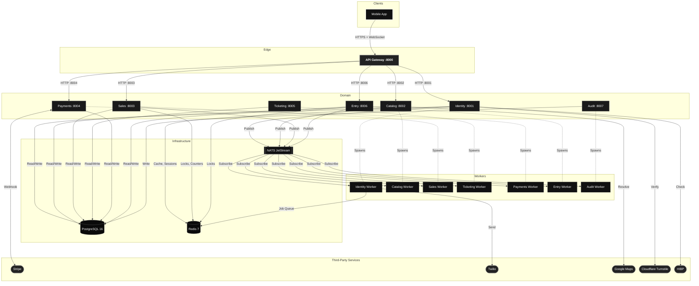
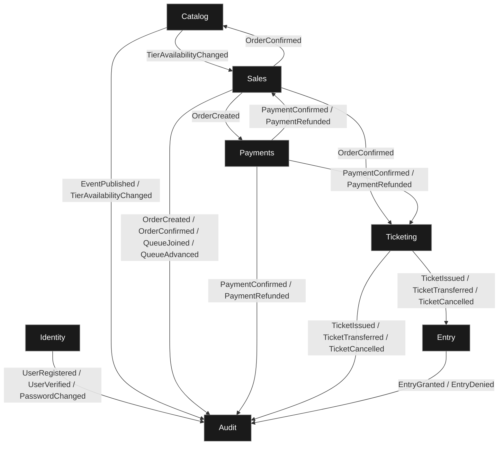
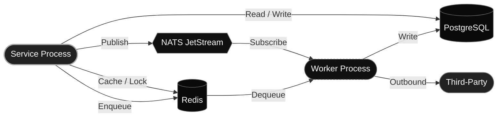
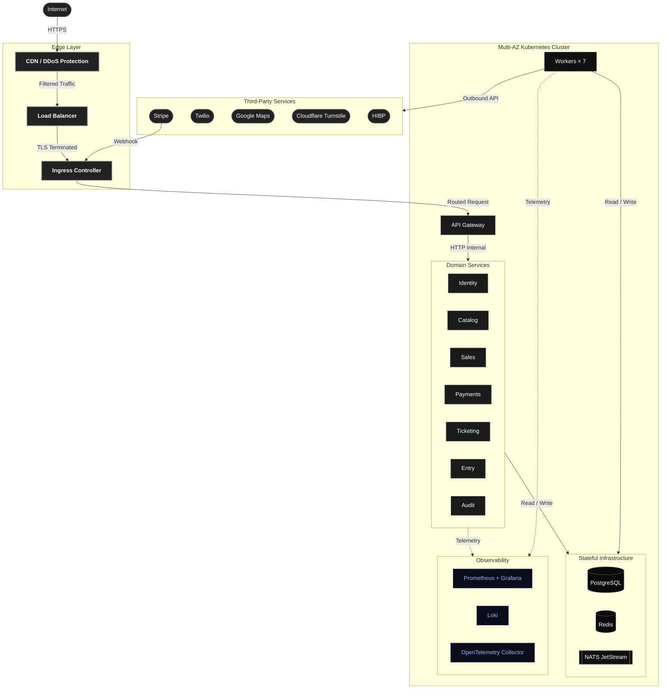
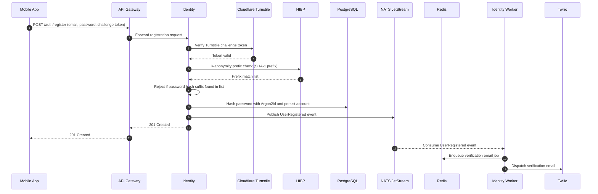
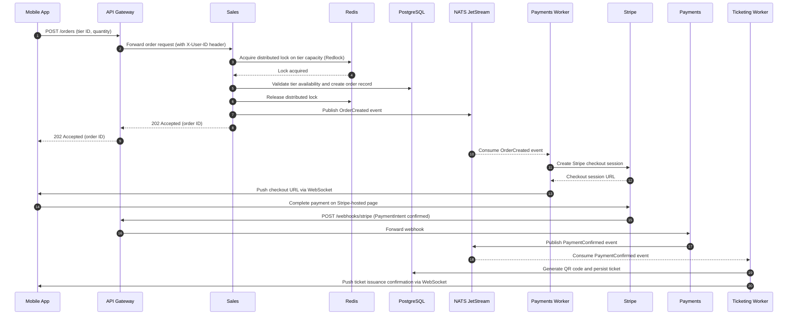
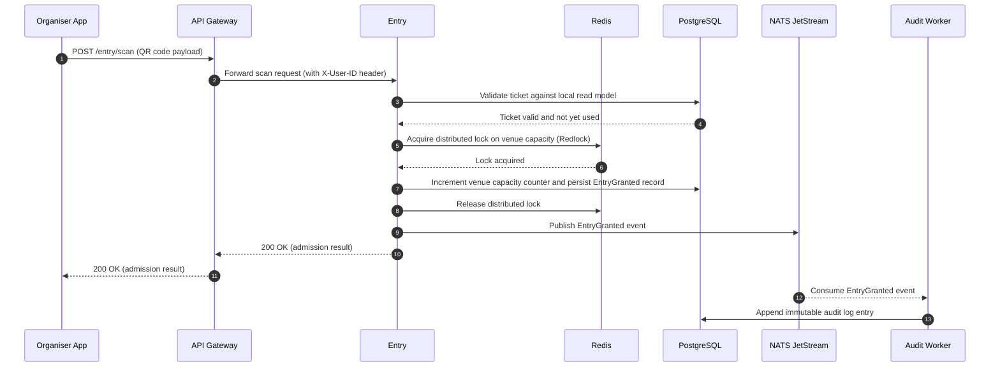
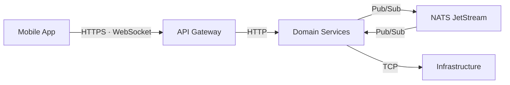
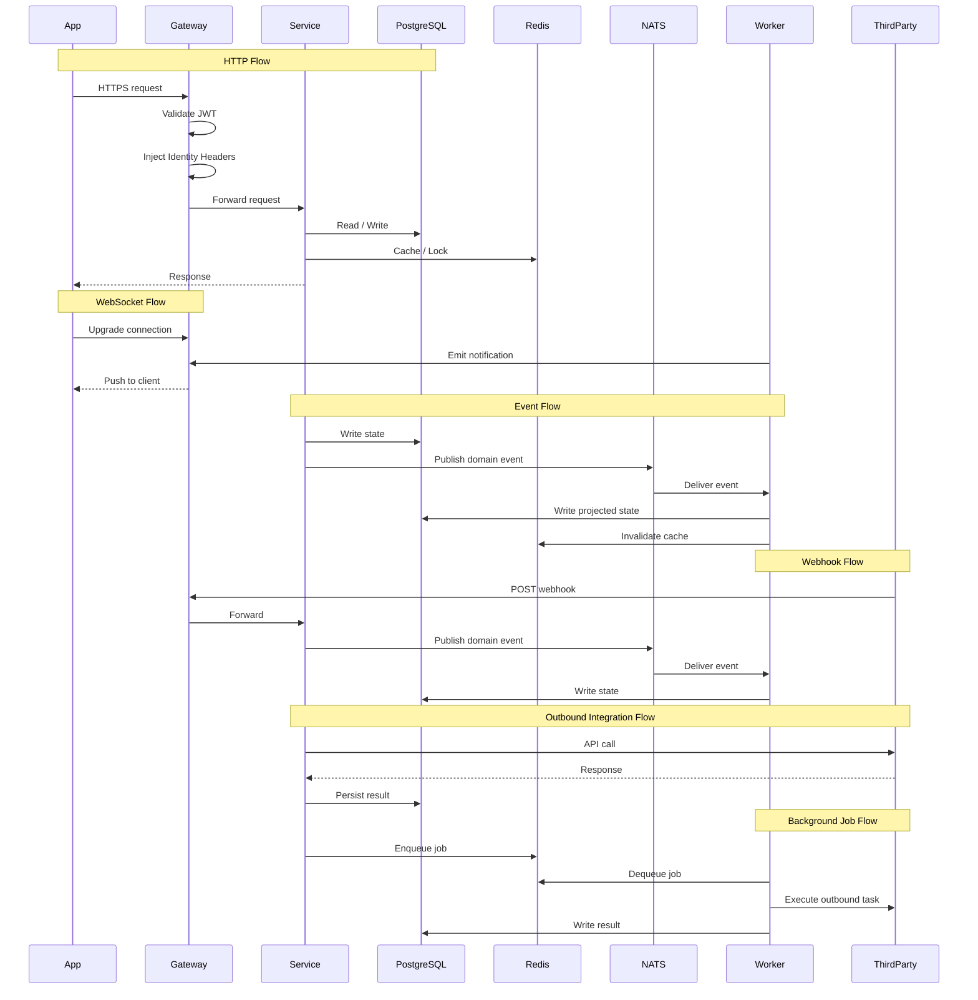

# Architecture

## Introduction

This document is the authoritative architectural reference for the system.

1. [Context & Scope](#context--scope)
2. [Architectural Principles](#architectural-principles)
3. [System Overview](#system-overview)
4. [Architectural Views](#architectural-views)
5. [Components Breakdown](#components-breakdown)
6. [Communication](#communication)
7. [Data Architecture](#data-architecture)
8. [Cross-Cutting Concerns](#cross-cutting-concerns)
9. [Infrastructure & Deployment](#infrastructure--deployment)

It is written for technical leads making design decisions and for engineers contributing to the codebase.

## Context & Scope

### Context

QREW is a mobile-first ticketing and event management platform covering the full operational lifecycle of a live event with fraud prevention and anti-speculation as first-class constraints.

### Scope

QREW is designed and implemented as a production-ready system that ensures the reliability characteristics expected of a deployed product.


## Architectural Principles

The following 5 software design principles shape every structural decision in the system:

<dl>
<dt>• <strong><em>Separation of Concerns.</em></strong></dt>
<dd>Every component addresses one well-defined concern and does not reach into the responsibility of another.</dd>
<dt>• <strong><em>Single Responsibility Principle.</em></strong></dt>
<dd>Every service, worker, and layer does exactly one thing, keeping each unit narrow and independently replaceable.</dd>
<dt>• <strong><em>Loose Coupling.</em></strong></dt>
<dd>Every component is independent at the code, data, and deployment level, so the failure of one does not propagate to others.</dd>
<dt>• <strong><em>Principle of Least Privilege.</em></strong></dt>
<dd>Every component is granted only the access it strictly requires to perform its function.</dd>
<dt>• <strong><em>Design for Failure.</em></strong></dt>
<dd>Every component is built under the assumption that it will eventually fail, and the system degrades gracefully when it does.</dd>
</dl>


## System Design

### High-Level Architecture

The system is organised into 6 layers:

- **Client**
- **Edge**
- **Domain**
- **Workers**
- **Infrastructure**
- **Third-Party Services**

The following diagram shows the full topology of the system:

<div align="center">



</div>

### Technology Stack

**Frontend**

[](https://react.dev/)
[](https://vitejs.dev/)
[](https://www.typescriptlang.org/)
[](https://tanstack.com/router)
[](https://tanstack.com/query)
[](https://zustand-demo.pmnd.rs/)
[](https://immerjs.github.io/immer/)
[](https://tailwindcss.com/)
[](https://www.radix-ui.com/)
[](https://www.framer.com/motion/)
[](https://lucide.dev/)
[](https://react-hook-form.com/)
[](https://zod.dev/)
[](https://axios-http.com/)
[](https://react.i18next.com/)
[](https://date-fns.org/)
[](https://github.com/rosskhanas/react-qr-code)
[](https://sonner.emilkowal.ski/)
[](https://capacitorjs.com/)
[](https://simplewebauthn.dev/)
[](https://stripe.com/docs/stripe-js)
[](https://github.com/googlemaps/js-api-loader)
[](https://github.com/marsidev/react-turnstile)
[](https://vitest.dev/)
[](https://testing-library.com/)
[](https://mswjs.io/)
[](https://eslint.org/)
[](https://prettier.io/)

**Backend**

[](https://www.python.org/)
[](https://fastapi.tiangolo.com/)
[](https://www.uvicorn.org/)
[](https://docs.pydantic.dev/latest/concepts/pydantic_settings/)
[](https://docs.sqlalchemy.org/)
[](https://github.com/MagicStack/asyncpg)
[](https://alembic.sqlalchemy.org/)
[](https://passlib.readthedocs.io/)
[](https://argon2-cffi.readthedocs.io/)
[](https://cryptography.io/)
[](https://pyjwt.readthedocs.io/)
[](https://webauthn.io/)
[](https://pyauth.github.io/pyotp/)
[](https://github.com/nats-io/nats.py)
[](https://arq-docs.helpmanual.io/)
[](https://redis.io/docs/latest/develop/use/patterns/distributed-locks/)
[](https://slowapi.readthedocs.io/)
[](https://opentelemetry.io/)
[](https://www.structlog.org/)
[](https://geoip2.readthedocs.io/)
[](https://www.python-httpx.org/)
[](https://github.com/madmaze/pytesseract)
[](https://opencv.org/)
[](https://pillow.readthedocs.io/)
[](https://github.com/stripe/stripe-python)
[](https://docs.pytest.org/)
[](https://testcontainers.com/)
[](https://github.com/cunla/fakeredis-py)
[](https://factoryboy.readthedocs.io/)
[](https://docs.astral.sh/ruff/)
[](https://github.com/microsoft/pyright)
[](https://docs.astral.sh/uv/)

**Infrastructure**

[](https://www.docker.com/)
[](https://docs.docker.com/compose/)
[](https://www.postgresql.org/)
[](https://redis.io/)
[](https://docs.nats.io/nats-concepts/jetstream)
[](https://www.jaegertracing.io/)

**Third-Party Services**

[](https://stripe.com/docs)
[](https://www.twilio.com/docs)
[](https://developers.google.com/maps)
[](https://developers.cloudflare.com/turnstile/)
[](https://haveibeenpwned.com/API/v3)

**Tooling**

[](https://docs.github.com/en/actions)
[](https://just.systems/)
[](https://typicode.github.io/husky/)
[](https://github.com/lint-staged/lint-staged)
[](https://commitlint.js.org/)
[](https://pre-commit.com/)


## Architectural Views

### Logical View

> [!NOTE]
> The logical view describes the primary domain abstractions and the bounded context decomposition of the platform.

The system is partitioned into 7 bounded contexts, each owning its own data model and enforcing its own invariants independently.

The following diagram shows every domain event flow between bounded contexts in the system:

<div align="center">



</div>

### Development View

> [!NOTE]
> The development view describes how the system is organised as source code.

#### **Frontend**

All code resides under `apps/app`, organised by feature module:

```
apps/app/
  src/
    routes/        Route Definitions
    features/      Feature Modules
    components/    Shared UI Primitives
    hooks/         Shared Hooks
    i18n/          Translations
    store/         Global State
    lib/           Utilities And Helpers
    config/        App Configuration
    assets/        Static Assets
    styles/        Global Styles
    test/          Tests
```

#### **Backend**:

All code resides under `apps/api`, with the gateway at `apps/api/gateway` and the seven domain services under `apps/api/services`, organised by an identical internal structure:

```
services/<name>/
  config/                           Environment Config
  migrations/                       Schema Migrations
  src/com/qode/qrew/v1/<name>/
    routers/                        Route Handlers
    services/                       Business Logic
    models/                         Persistence Models
    repositories/                   Data Access
    schemas/                        Request/Response Contracts
    worker/                         Background Jobs
    core/                           Shared Setup
  tests/                            Tests
```


### Process View

> [!NOTE]
> The process view describes the runtime model, covering how services and workers run as separate processes and how they communicate through shared infrastructure.

The follwoing diagram shows how services handle requests, how workers handle asynchronous work, and the communication channels each one maintains in the system:

<div align="center">



</div>

### Physical View

> [!NOTE]
> The physical view describes how software components map to infrastructure at deployment time.

The following diagram shows the recommended production setup for the system:

<div align="center">



</div>

The following table describes what the production deployment would recommend for each layer and element shown above, from the public internet entry point down to the external providers the platform integrates with in the system.

<div align="center">

| Component | Description |
|---|---|
| CDN / DDoS Protection | Should absorb volumetric attacks and cache static assets at the network edge before traffic reaches the cluster. |
| Load Balancer | Should serve as the cloud-managed TLS termination point, distributing inbound connections across Ingress Controller replicas. |
| Ingress Controller | Should route HTTP traffic to internal services, manage certificate lifecycle via Cert-Manager, and enforce per-route rate limiting. |
| API Gateway | Should be the sole application-level entry point, validating JWT tokens and routing each request to the correct domain service. |
| Domain Services | Should each run with a minimum of two replicas spread across availability zones, scaled individually via HPA. |
| Workers | Should run as independent deployments, one per domain service, consuming events and job queues asynchronously. |
| PostgreSQL | Should run as a primary with read replicas, fronted by PgBouncer for connection pooling and backed by daily off-cluster backups. |
| Redis | Should operate in Sentinel mode, serving distributed locking, session caching, and the asynchronous job queue. |
| NATS JetStream | Should run as a clustered deployment with stream replication, carrying all cross-context domain events durably. |
| Prometheus + Grafana | Should scrape metrics from all workloads and provide alerting rules and on-call routing. |
| Loki | Should aggregate structured logs from all workloads, indexed for query and incident investigation. |
| OpenTelemetry Collector | Should receive distributed traces from all services and forward them to a compatible tracing backend. |
| Stripe | Should handle payment processing, with outbound calls from the Payments worker and inbound webhooks through the Ingress Controller. |
| Twilio | Should deliver SMS and transactional email, called exclusively by the Identity worker. |
| Google Maps | Should provide venue geocoding, called exclusively by the Catalog service. |
| Cloudflare Turnstile | Should verify bot prevention challenge tokens at registration, called exclusively by the Identity service. |
| HIBP | Should screen credentials against the breached password database at registration and password change, called exclusively by the Identity service. |

</div>

### Scenario View

> [!NOTE]
> The scenario view illustrates key system behaviours end to end, demonstrating how the architectural layers collaborate under realistic conditions.

The following situations present representative sequences that illustrate how the architectural layers collaborate under realistic conditions, covering the 3 core flows of the system.

**User Registration**

The following sequence traces an example of the full account creation flow, from the initial client request through external verification and asynchronous email dispatch.

<div align="center">



</div>

**Ticket Purchase**

The following sequence traces the full ticket purchase flow, from order submission through distributed lock acquisition, payment initiation, webhook confirmation, and asynchronous ticket issuance.

<div align="center">



</div>

**Entry Scanning**

The following sequence traces the admission flow, from QR code scan at the venue through capacity enforcement, event publishing, and real-time confirmation.

<div align="center">



</div>

## Components Breakdown

### Frontend

- [App](../apps/app/overview.md)

### Backend

#### API Gateway

- [Gateway](../apps/api/services/gateway/overview.md)

#### Domain Services

- [Identity](../apps/api/services/identity/overview.md)
- [Catalog](../apps/api/services/catalog/overview.md)
- [Sales](../apps/api/services/sales/overview.md)
- [Payments](../apps/api/services/payments/overview.md)
- [Ticketing](../apps/api/services/ticketing/overview.md)
- [Entry](../apps/api/services/entry/overview.md)
- [Audit](../apps/api/services/audit/overview.md)


## Communication

### APIs

- **Style:** REST
- **Format:** JSON
- **Versioning:** `/v1`
- **Auth:** Bearer token

### Protocols

<div align="center">



</div>

### Internal Communication

#### Event Messaging

- **Broker:** NATS JetStream
- **Delivery:** At-least-once
- **Subject format:** `<context>.<entity>.<event>`
- **Envelope:** `<type> | <version> | <timestamp> | <service> | <correlation_id>`
- **Acknowledgment:** On success
- **Failure:** Retry

### External Interfaces

| Provider | Protocol | Direction |
|---|---|---|
| Stripe | REST · Webhook | Bidirectional |
| Twilio | REST | Outbound |
| Google Maps | REST | Outbound |
| Cloudflare Turnstile | REST | Outbound |
| HIBP | REST · K-Anonymity | Outbound |

## Data Architecture

### Data Ownership

<dl>
<dt>• <strong><em>Schema Isolation.</em></strong></dt>
<dd>Each service owns a dedicated PostgreSQL schema, shared with no other service.</dd>
<dt>• <strong><em>Autonomous Evolution.</em></strong></dt>
<dd>Each service manages its own Alembic migration history independently.</dd>
<dt>• <strong><em>Exclusive Write Authority.</em></strong></dt>
<dd>Each service is the sole writer to its own schema.</dd>
<dt>• <strong><em>No Cross-Service Reads.</em></strong></dt>
<dd>Each service accesses foreign data exclusively through published domain events, never by querying another service's schema directly.</dd>
<dt>• <strong><em>Event-Driven Projection.</em></strong></dt>
<dd>Each service projects the read models it needs from domain events into its own schema.</dd>
<dt>• <strong><em>Eventual Consistency.</em></strong></dt>
<dd>Each service boundary is kept consistent asynchronously through the event stream, without distributed transactions.</dd>
</dl>

### Data Storage

| Store | Technology | Role |
|---|---|---|
| Primary Database | PostgreSQL 16 | Transactional State |
| Cache / Queue / Lock | Redis 7 | Session Cache · Redlock Distributed Locks · Arq Job Queue  |
| Message Bus | NATS JetStream | Durable Event Streaming |


### Data Model

The following documents describe the database schema for each bounded context in the system:

- [Identity](../apps/api/services/identity/schema.md)
- [Catalog](../apps/api/services/catalog/schema.md)
- [Sales](../apps/api/services/sales/schema.md)
- [Payments](../apps/api/services/payments/schema.md)
- [Ticketing](../apps/api/services/ticketing/schema.md)
- [Entry](../apps/api/services/entry/schema.md)
- [Audit](../apps/api/services/audit/schema.md)


### Data Flow

<div align="center">



</div>

## Cross-Cutting Concerns

### Security

The full dive into the topic is in [Security](cross-cutting/security.md).

### Observability

The full dive into the topic is in [Observability](cross-cutting/observability.md).

## Infrastructure & Deployment

<div align="center">

*⏳ Pending...*

</div>


