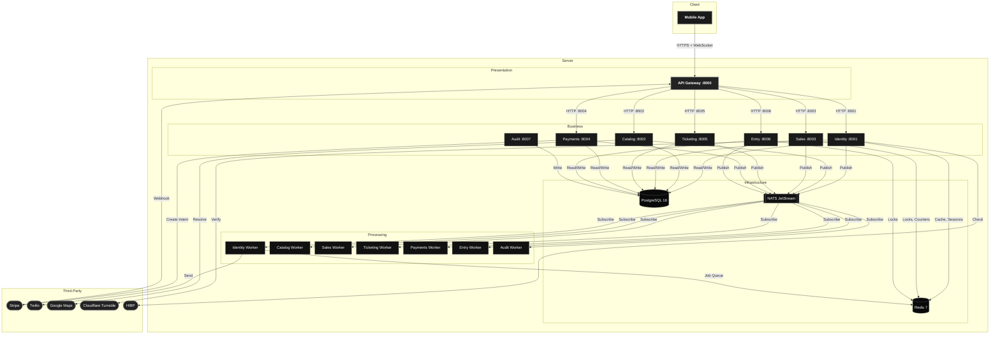
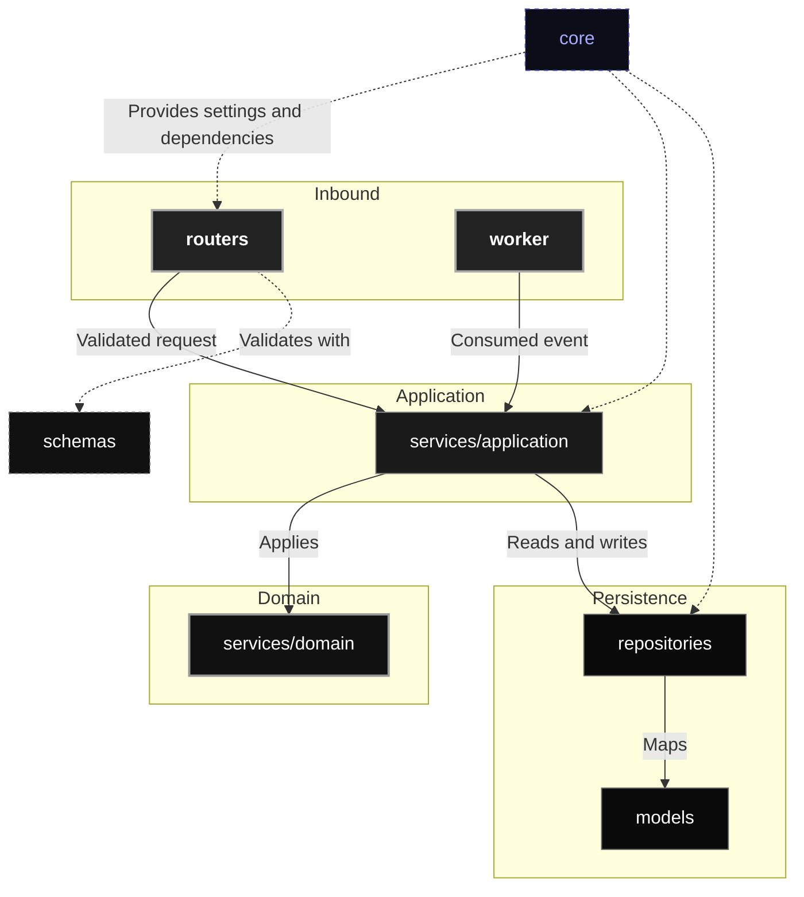

# Architecture

This document is the architectural reference for the system.

QREW is a mobile-first ticketing platform that covers the operational lifecycle of a live
event, with fraud prevention and anti-speculation as first-class constraints.

1. [System Architecture](#system-architecture)
   - [Style](#style)
   - [Decision Records](#decision-records)
2. [View Model](#view-model)
3. [Server Design](#server-design)
   - [Architecture of a Service](#architecture-of-a-service)
   - [Services](#services)
   - [Workers](#workers)
   - [Technologies](#technologies)
4. [Client Design](#client-design)
   - [Architecture of the App](#architecture-of-the-app)
   - [Technologies](#technologies)
5. [Communication](#communication)
   - [Protocols, Temporality and Formats](#protocols-temporality-and-formats)
   - [Server Communication](#server-communication)
   - [Client Communication](#client-communication)
   - [Client and Server Communication](#client-and-server-communication)
6. [Security](#security)
7. [Observability](#observability)

## System Architecture

The system splits into three blocks, the interface the actors handle, the server that resolves
the logic and keeps the state, and the third-party services it delegates to for whatever
carries no differential value.

The following diagram shows the full topology of the system:

The client is a single mobile application for Android and iOS, whose job is limited to showing
information, collecting what the user decides and keeping the credential on the device,
without resolving any business rule of its own.

The server is structured in layers. The presentation layer is the API Gateway, the only door
from the outside, which authenticates every call, routes it to whoever must serve it and holds
the channel the notices later arrive through.

The business layer gathers the seven services, delimited by the responsibility they take on,
each owning its data and deployable on its own. None of them calls another to serve a request;
each decides with what it already holds, and whatever the rest need to know travels afterwards
as a published event.

The infrastructure layer provides the durable messaging the domain events travel on, the
auxiliary memory that supplies the distributed lock and the relational store that keeps the
state alongside the outbox.

The processing layer gathers the workers, which consume those notices, run whatever needs no
immediate answer and refresh the local projections.

The third block is the third-party services, which take on payment, message delivery and the
checks the platform does not perform itself. The server calls almost all of them, and whatever
comes back enters through the API Gateway, so no call escapes authentication.

### Style

The structure above answers to a recognisable style, an **event-driven microservice
architecture with choreography**, and each term of that name rules out a family of
alternatives.

- [Microservices](https://microservices.io/patterns/microservices.html)
- [Event-driven architecture](https://microservices.io/patterns/data/event-driven-architecture.html)
- [Choreography](https://learn.microsoft.com/en-us/azure/architecture/patterns/choreography)

### Decision Records

The full dive into the topic is in [ADR](adr.md).

## View Model

The 4+1 model explains the system through four views, each answering one question, and a
fifth that checks the other four hold together.

| View | Question it answers | Document |
|---|---|---|
| Logical | What the platform does and how responsibilities split | [Logical](views/logical.md) |
| Process | What runs concurrently and how it synchronises | [Process](views/process.md) |
| Development | How the code is laid out and what depends on what | [Development](views/development.md) |
| Physical | What runs where, as it stands today | [Physical](views/physical.md) |
| Scenarios | How the pieces meet on the critical journeys | [Scenarios](views/scenarios.md) |

## Server Design

### Architecture of a Service

Every service shares the same internal layout, a layered architecture with an isolated
domain, where dependencies always point inwards and no inner layer knows its caller.

### Services

| Service | Documents |
|---|---|
| API Gateway | [Overview](apps/api/services/gateway/overview.md) |
| Identity | [Overview](apps/api/services/identity/overview.md) · [Schema](apps/api/services/identity/schema.md) · [Events](apps/api/services/identity/events.md) |
| Catalog | [Overview](apps/api/services/catalog/overview.md) · [Schema](apps/api/services/catalog/schema.md) · [Events](apps/api/services/catalog/events.md) |
| Sales | [Overview](apps/api/services/sales/overview.md) · [Schema](apps/api/services/sales/schema.md) · [Events](apps/api/services/sales/events.md) |
| Payments | [Overview](apps/api/services/payments/overview.md) · [Schema](apps/api/services/payments/schema.md) · [Events](apps/api/services/payments/events.md) |
| Ticketing | [Overview](apps/api/services/ticketing/overview.md) · [Schema](apps/api/services/ticketing/schema.md) · [Events](apps/api/services/ticketing/events.md) |
| Entry | [Overview](apps/api/services/entry/overview.md) · [Schema](apps/api/services/entry/schema.md) · [Events](apps/api/services/entry/events.md) |
| Audit | [Overview](apps/api/services/audit/overview.md) · [Schema](apps/api/services/audit/schema.md) |

### Workers

A worker is a process that runs beside its service and serves no request. It wakes on a clock
to sweep what has expired, and reacts to the events other services publish to refresh its
local projections.

| Worker | Document |
|---|---|
| Identity | [Events](apps/api/services/identity/events.md) |
| Catalog | [Events](apps/api/services/catalog/events.md) |
| Sales | [Events](apps/api/services/sales/events.md) |
| Ticketing | [Events](apps/api/services/ticketing/events.md) |
| Entry | [Events](apps/api/services/entry/events.md) |
| Payments | [Events](apps/api/services/payments/events.md) |
| Audit | [Overview](apps/api/services/audit/overview.md) |

### Technologies

#### Edge

- [Python](https://www.python.org/)
- [FastAPI](https://fastapi.tiangolo.com/)
- [Uvicorn](https://www.uvicorn.org/)
- [Pydantic](https://docs.pydantic.dev/)
- [slowapi](https://slowapi.readthedocs.io/)
- [httpx](https://www.python-httpx.org/)
- [geoip2](https://geoip2.readthedocs.io/)
- [OpenTelemetry](https://opentelemetry.io/)
- [Structlog](https://www.structlog.org/)

#### Domain

- [Python](https://www.python.org/)
- [FastAPI](https://fastapi.tiangolo.com/)
- [Uvicorn](https://www.uvicorn.org/)
- [Pydantic](https://docs.pydantic.dev/)
- [SQLAlchemy](https://docs.sqlalchemy.org/)
- [asyncpg](https://github.com/MagicStack/asyncpg)
- [Alembic](https://alembic.sqlalchemy.org/)
- [Passlib](https://passlib.readthedocs.io/)
- [argon2-cffi](https://argon2-cffi.readthedocs.io/)
- [cryptography](https://cryptography.io/)
- [PyJWT](https://pyjwt.readthedocs.io/)
- [webauthn](https://webauthn.io/)
- [pyotp](https://pyauth.github.io/pyotp/)
- [nats-py](https://github.com/nats-io/nats.py)
- [arq](https://arq-docs.helpmanual.io/)
- [Redlock](https://redis.io/docs/latest/develop/use/patterns/distributed-locks/)
- [OpenCV](https://opencv.org/)
- [Pillow](https://pillow.readthedocs.io/)
- [OpenTelemetry](https://opentelemetry.io/)
- [Structlog](https://www.structlog.org/)

#### Infrastructure

- [PostgreSQL](https://www.postgresql.org/)
- [Redis](https://redis.io/)
- [NATS JetStream](https://docs.nats.io/nats-concepts/jetstream)
- [Docker](https://www.docker.com/)
- [Docker Compose](https://docs.docker.com/compose/)
- [Jaeger](https://www.jaegertracing.io/)

#### Third-party Services

- [Stripe](https://stripe.com/docs)
- [Twilio](https://www.twilio.com/docs)
- [Google Maps](https://developers.google.com/maps)
- [Cloudflare Turnstile](https://developers.cloudflare.com/turnstile/)
- [HIBP](https://haveibeenpwned.com/API/v3)

#### Tooling

- [GitHub Actions](https://docs.github.com/en/actions)
- [just](https://just.systems/)
- [uv](https://docs.astral.sh/uv/)
- [Ruff](https://docs.astral.sh/ruff/)
- [Pyright](https://github.com/microsoft/pyright)
- [ESLint](https://eslint.org/)
- [Prettier](https://prettier.io/)
- [Vitest](https://vitest.dev/)
- [pytest](https://docs.pytest.org/)
- [Husky](https://typicode.github.io/husky/)
- [commitlint](https://commitlint.js.org/)
- [pre-commit](https://pre-commit.com/)

## Client Design

### Architecture of the App

The full dive into the topic is in [App](apps/app/overview.md).

### Technologies

- [TypeScript](https://www.typescriptlang.org/)
- [React](https://react.dev/)
- [Vite](https://vitejs.dev/)
- [Capacitor](https://capacitorjs.com/)
- [TanStack Router](https://tanstack.com/router)
- [TanStack Query](https://tanstack.com/query)
- [Zustand](https://zustand-demo.pmnd.rs/)
- [Immer](https://immerjs.github.io/immer/)
- [Tailwind CSS](https://tailwindcss.com/)
- [Radix UI](https://www.radix-ui.com/)
- [Framer Motion](https://www.framer.com/motion/)
- [React Hook Form](https://react-hook-form.com/)
- [Zod](https://zod.dev/)
- [Axios](https://axios-http.com/)
- [react-i18next](https://react.i18next.com/)
- [SimpleWebAuthn](https://simplewebauthn.dev/)
- [Stripe Elements](https://stripe.com/docs/stripe-js)
- [Lucide React](https://lucide.dev/)
- [Sonner](https://sonner.emilkowal.ski/)
- [date-fns](https://date-fns.org/)

## Communication

Communication happens in three scenarios, and each one raises the same four questions: what
travels, how it is delivered, what keeps both sides from telling contradictory stories, and
what happens when something fails.

| | On the server | On the client | Between the two |
|---|---|---|---|
| **Messages** | Domain events with a versioned contract | Session state and cache entries | Interface resources and notices |
| **Delivery** | Publish and subscribe over durable messaging | Shared store and notice provider | Request and response, plus a permanent channel |
| **Consistency** | Outbox, retry and operation key | Invalidation by key after every write | Versioning, idempotency and credential renewal |
| **Errors** | Retry and dead letter queue | Surfaced as an interruption | Status codes and problem details |

Failures fall into the same three categories wherever they arise. A **domain** failure says the
operation does not apply, and repeating it changes nothing. An **infrastructure** failure says
something is not answering, and there a retry helps, since unavailability is usually passing. A
**contract** failure says what arrived does not match what was declared, which betrays a defect
or an uncoordinated deployment, so retrying would only repeat it.

### Protocols, Temporality and Formats

#### Protocols

**HTTP** joins the device with the API Gateway and carries whatever the user asks for or
sends. It is used because every action of theirs starts with a gesture and expects an answer
at once, which is exactly the request and response model, and because its methods and status
codes already say what happened, with no need to invent a language of one's own.

**TLS** wraps the traffic between the device and the API Gateway, both the requests and the
notices. It is used because credentials and personal data travel there, which without
encryption would be legible to anyone listening on the network, and only the local
environment goes without it, for lack of certificates.

**HTTP** reappears, this time unencrypted, between the API Gateway and each service, when the
already verified request is forwarded. It is kept, rather than adopting a faster binary
protocol, because it avoids translating formats at the boundary and allows following one
request end to end with the same tools, at the cost of an efficiency that inside a single
network goes unnoticed.

**WebSocket** holds an open connection between the API Gateway and the device through which
the server speaks first. It is used because some news answers no question, such as a payment
being confirmed or a turn coming up in the queue, and asking every few seconds would drain the
battery and still arrive late when it matters most.

**NATS JetStream** joins the services to one another, which never call each other and instead
publish what happens to them for whoever has an interest. It is used because JetStream keeps
those events in streams until every recipient consumes them, so a service that is down or
mid-deployment loses nothing and finds on its return everything that happened while it was
away.

#### Temporality

Synchronous calls serve any operation whose result is needed to carry on, and whoever makes
them waits for the answer before continuing.

Asynchronous messaging serves everything that must happen because of an operation but with
nobody waiting for it, and whoever publishes the event moves on.

#### Formats

Everything that travels through the system, both the request and its response and the event a
service publishes, goes in JSON, which both ends read without translation and anyone can
inspect while debugging.

The shape of that content is not taken on trust but checked at every boundary, since the
server declares each field and its type in models that validate what comes in and trim what
goes out, while the client does the same with equivalent schemas in its own language, and
neither check is optional, so malformed data stops where it appears instead of spreading.

The normalised description of the interface comes from those same models and the server
generates it on its own, so the documentation is neither written apart nor able to fall behind
the code, because changing a field changes both the validation and what is published about it.

Event contracts get identical treatment, with the particularity of being declared once in a
shared package that both publisher and consumer depend on, so the two use literally the same
definition instead of two copies that would drift apart over time.

### Server Communication

What travels between services are domain events, facts that already happened, published to
durable streams and picked up by whoever has an interest.

The full dive into the topic is in [Messaging](apps/api/messaging/messaging.md),
[Streams](apps/api/messaging/streams.md) and [Subjects](apps/api/messaging/subjects.md).

### Client Communication

What travels inside the device is session state, which survives a restart, and the server
cache, held under a key and invalidated after every write.

The full dive into the topic is in [App](apps/app/overview.md).

### Client and Server Communication

What travels between the device and the server are interface resources, which arrive on
request, and notices, which the server sends on its own through the permanent channel.

#### External Interfaces

| Provider | Protocol | Direction |
|---|---|---|
| Stripe | REST · Webhook | Bidirectional |
| Twilio | REST | Outbound |
| Google Maps | REST | Outbound |
| Cloudflare Turnstile | REST | Outbound |
| HIBP | REST · K-Anonymity | Outbound |

## Security

The full dive into the topic is in [Security](apps/api/security.md).

## Observability

The full dive into the topic is in [Observability](apps/api/observability.md).
