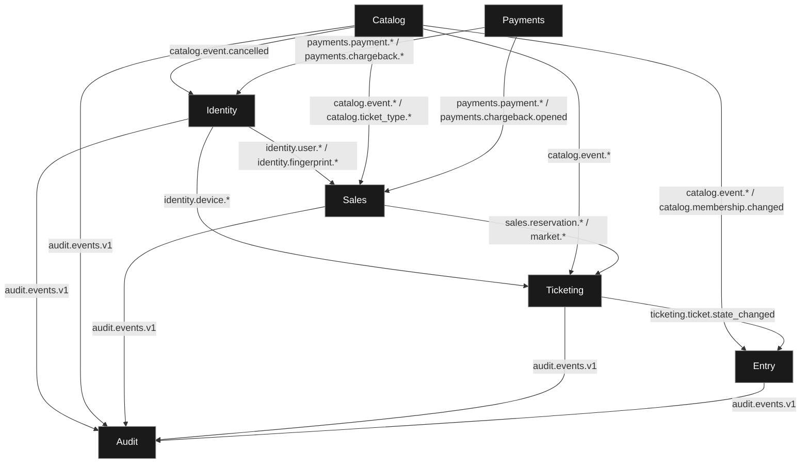

# Logical view

> [!NOTE]
> The logical view describes what the platform does and how the responsibilities split between its bounded contexts.

Every arrow is a domain event on NATS, so it means "publishes, and the other end happens to subscribe" rather than "calls". Labels are subject families; see [subjects.md](../apps/api/messaging/subjects.md) for the exact list. Four synchronous calls survive alongside them and are listed at the end.

Three things the diagram makes visible.

Payments receives nothing. It is driven by the client opening a payment intent and by the Stripe webhook, so no context tells it what to do.

Entry is a pure sink. It consumes from Catalog and Ticketing to keep its projections, and it publishes no domain event of its own, only audit records and the WebSocket fanout the Gateway forwards.

Audit hears from five contexts, not seven. Payments writes no audit record, and neither does the Gateway.

## Synchronous calls between contexts

Four calls do not go through the broker, because the caller needs the answer before it can continue. They are the exception, not the pattern, and each one couples the caller's availability to the callee's.

| Caller | Callee | Endpoint | Why it cannot be an event |
|---|---|---|---|
| Payments | Sales | `POST /v1/billing/reservations/{id}/charge` and `.../market-assignments/{id}/charge` | Payments must know the amount, and whether the reservation may still be charged, before it opens the intent with Stripe |
| Entry | Ticketing | `POST /v1/admission/{ticket_id}/use` | The door needs the ticket marked used, and the answer, before it lets the holder through |
| Catalog | Identity | `GET /v1/_internal/users/lookup` | Resolves an email or document to a user when an organiser invites someone by name |
| Identity | Audit | `GET /v1/_internal/events` | Reads back the audit trail an account asks to see, which is a query and not a state change |

The first two sit on the critical path of a purchase and of an admission. The other two are reads.

Entry once made a fifth call, to Catalog, to resolve organisation membership. It now keeps that as a local projection instead, which is the pattern to follow for any of the remaining four that turns out to hurt.
