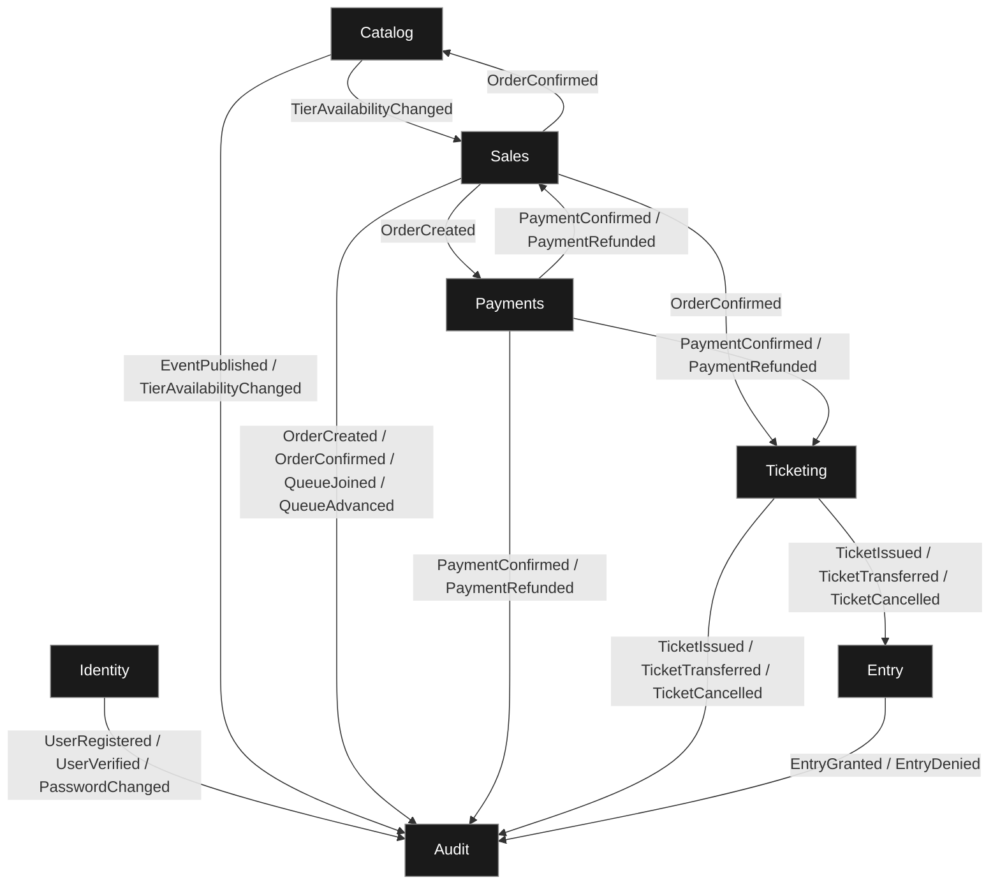

# Logical view

> [!NOTE]
> The logical view describes what the platform does and how the responsibilities split between its bounded contexts.

```mermaid
flowchart TB
    identity["Identity"]:::ctx
    catalog["Catalog"]:::ctx
    sales["Sales"]:::ctx
    payments["Payments"]:::ctx
    ticketing["Ticketing"]:::ctx
    entry["Entry"]:::ctx
    audit["Audit"]:::ctx

    catalog   -->|"TierAvailabilityChanged"| sales
    sales     -->|"OrderCreated"| payments
    payments  -->|"PaymentConfirmed / PaymentRefunded"| sales
    sales     -->|"OrderConfirmed"| ticketing
    payments  -->|"PaymentConfirmed / PaymentRefunded"| ticketing
    ticketing -->|"TicketIssued / TicketTransferred / TicketCancelled"| entry
    sales     -->|"OrderConfirmed"| catalog

    identity  -->|"UserRegistered / UserVerified / PasswordChanged"| audit
    catalog   -->|"EventPublished / TierAvailabilityChanged"| audit
    sales     -->|"OrderCreated / OrderConfirmed / QueueJoined / QueueAdvanced"| audit
    payments  -->|"PaymentConfirmed / PaymentRefunded"| audit
    ticketing -->|"TicketIssued / TicketTransferred / TicketCancelled"| audit
    entry     -->|"EntryGranted / EntryDenied"| audit

    classDef ctx fill:#1a1a1a,color:#fff,stroke:#888,stroke-width:1px
```

