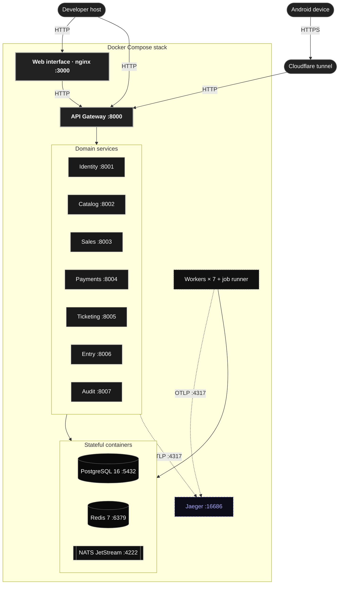

# Physical view

> [!NOTE]
> The physical view describes how the software maps onto machines today. It documents the
> environment that exists, not a target deployment.

The system runs as a single Docker Compose stack. Every component is a container on one host,
the domain services are reachable only through the API Gateway, and the data stores are the
sole stateful pieces.

## Containers

| Container | Image or build | Published port | State |
|---|---|---|---|
| PostgreSQL | `postgres:16-alpine` | `5432` | Named volume, one schema per service |
| Redis | `redis:7-alpine` | `6379` | Named volume, locks, cache and job queue |
| NATS JetStream | `nats:2.10-alpine` | `4222`, `8222` | Named volume, durable streams |
| API Gateway | Built from `apps/api/gateway` | `8000` | Stateless |
| Domain services × 7 | Built from `apps/api/services/*` | Internal only | Stateless |
| Workers × 7 | Same images, worker entry point | None | Stateless |
| Job runner | Identity image, `worker.runner` | None | Stateless, scheduled jobs |
| Web interface | Built from `apps/app` | `3000` | Static bundle served by nginx |
| Jaeger | `jaegertracing/all-in-one` | `16686`, `4317`, `4318` | In-memory traces |

## Access paths

- **Browser.** The web interface on `3000` calls the API Gateway on `8000`.
- **Development server.** Vite on `5173` proxies `/api` and `/ws` to the API Gateway.
- **Android device.** The native shell loads the interface through a Cloudflare tunnel that
  reaches the same API Gateway, so the phone exercises the real stack over HTTPS.

## Migrations and startup

Each service applies its own migration on start, so bringing the stack up on an empty volume
creates every schema. Services expose liveness and readiness probes, and Compose waits on
them before starting the components that depend on them.
