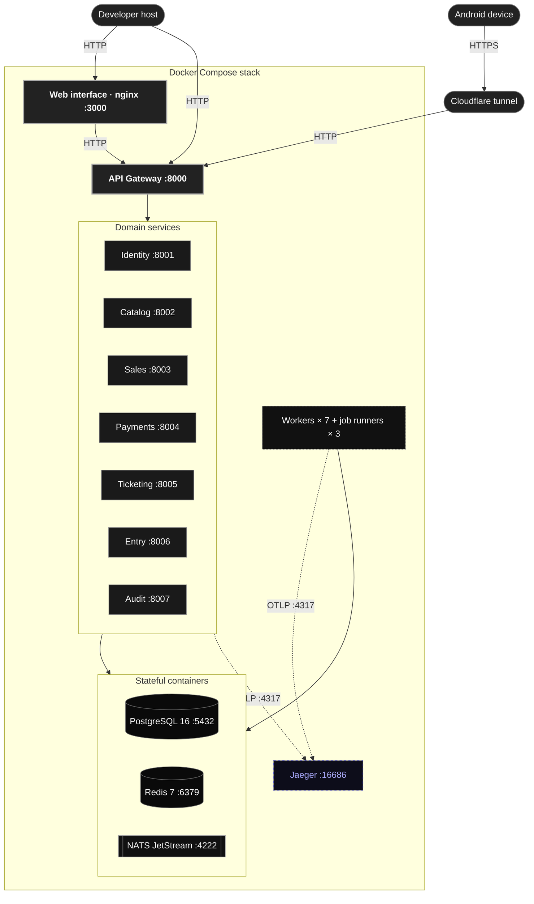

# Physical view

> [!NOTE]
> The physical view describes how the software maps onto machines as it stands today.

```mermaid
flowchart TB
    dev(["Developer host"]):::ext

    subgraph Compose["Docker Compose stack"]
        web["Web interface · nginx :3000"]:::edge
        gw["API Gateway :8000"]:::edge

        subgraph Services["Domain services"]
            identity["Identity :8001"]:::svc
            catalog["Catalog :8002"]:::svc
            sales["Sales :8003"]:::svc
            payments["Payments :8004"]:::svc
            ticketing["Ticketing :8005"]:::svc
            entry["Entry :8006"]:::svc
            audit["Audit :8007"]:::svc
        end

        workers["Workers × 7 + job runners × 3"]:::worker

        subgraph Stores["Stateful containers"]
            pg[("PostgreSQL 16 :5432")]:::db
            redis[("Redis 7 :6379")]:::db
            nats[["NATS JetStream :4222"]]:::bus
        end

        jaeger["Jaeger :16686"]:::obs
    end

    phone(["Android device"]):::ext
    tunnel(["Cloudflare tunnel"]):::ext

    dev -->|"HTTP"| web
    dev -->|"HTTP"| gw
    phone -->|"HTTPS"| tunnel
    tunnel -->|"HTTP"| gw
    web -->|"HTTP"| gw
    gw --> Services
    Services --> Stores
    workers --> Stores
    Services -.->|"OTLP :4317"| jaeger
    workers -.->|"OTLP :4317"| jaeger

    classDef edge   fill:#222,color:#fff,stroke:#aaa,stroke-width:2px,font-weight:bold
    classDef svc    fill:#1a1a1a,color:#fff,stroke:#888,stroke-width:1px
    classDef worker fill:#111,color:#fff,stroke:#666,stroke-width:1px,stroke-dasharray:3
    classDef db     fill:#0a0a0a,color:#fff,stroke:#666,stroke-width:1px
    classDef bus    fill:#111,color:#fff,stroke:#999,stroke-width:1px
    classDef obs    fill:#0d0d1a,color:#aaaaff,stroke:#4444aa,stroke-width:1px,stroke-dasharray:4
    classDef ext    fill:#222,color:#fff,stroke:#777,stroke-width:1px
```

