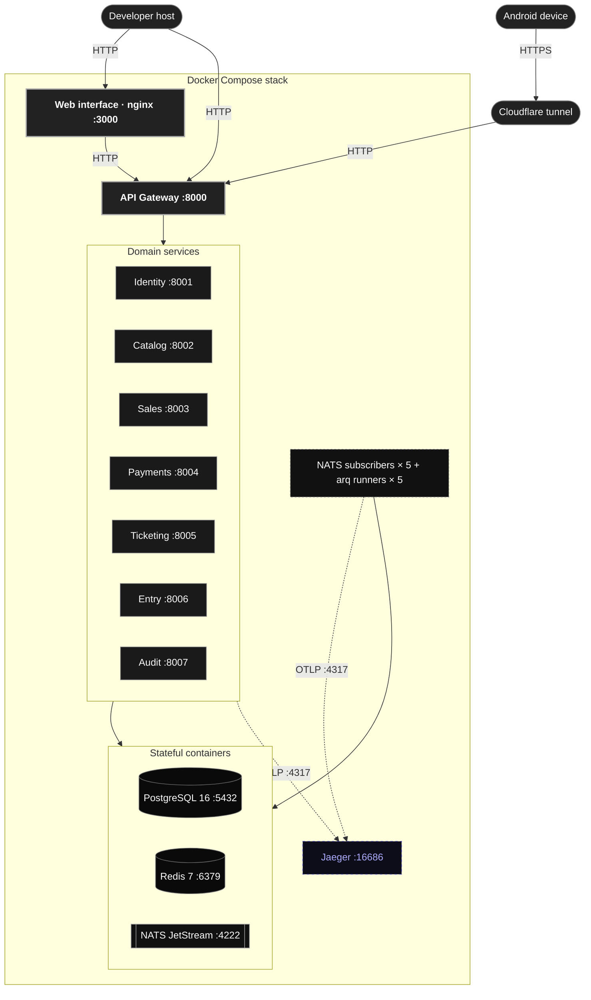
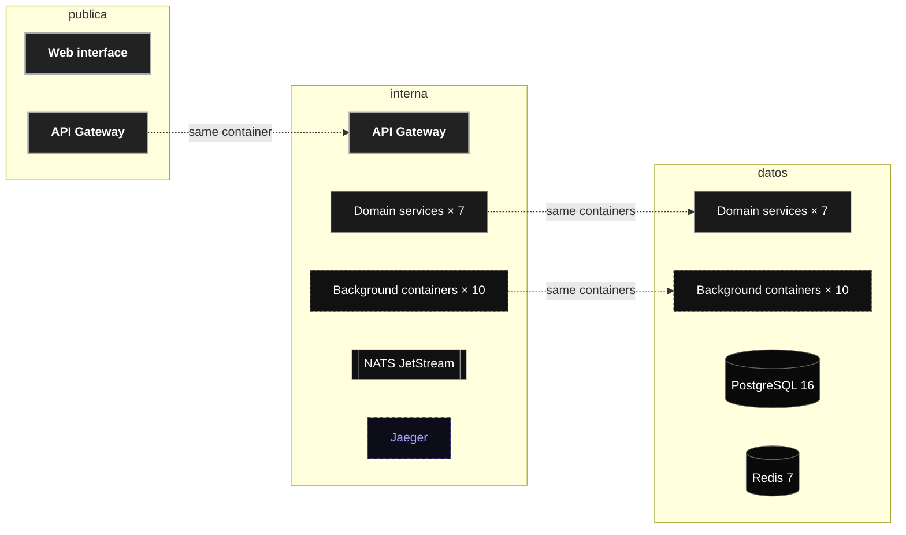

# Physical view

> [!NOTE]
> The physical view describes how the software maps onto machines as it stands today.

## Network segmentation

The stack does not run on a single flat network. `docker-compose.yml` declares three bridge networks, and a container only joins the ones it needs, so a compromised edge container cannot reach the datastores directly.

| Network | Members | Purpose |
|---|---|---|
| `publica` | `frontend`, `gateway` | The only surface that faces the outside. The web interface talks to the gateway and to nothing else. |
| `interna` | `gateway`, the seven domain services, the ten background containers, `nats`, `jaeger` | Service to service HTTP, the message broker, and trace export. The gateway reaches the services here, but never the databases. |
| `datos` | The seven domain services, the ten background containers, `postgres`, `redis` | Persistence and cache. Neither the gateway nor the frontend joins it. |

Only `frontend` (3000), `gateway` (8000), `postgres` (5432), `redis` (6379), `nats` (4222 and 8222) and `jaeger` (16686, 4317, 4318) publish ports to the developer host. The domain services are reachable from the host only through the gateway.

## Background containers

Ten containers run outside the request path. Five subscribe to NATS and keep local projections up to date; five are arq runners that consume a Redis job queue. All of them carry `restart: unless-stopped`.

| Container | Kind | Queue or role |
|---|---|---|
| `identity-worker` | NATS subscriber | Catalog cancellation and payment outcome notifications |
| `entry-worker` | NATS subscriber | Ticket state, event, and organisation membership projections |
| `ticketing-worker` | NATS subscriber | Catalog, identity, sales, and market projections |
| `sales-worker` | NATS subscriber | Catalog, identity, and payment projections |
| `audit-worker` | NATS subscriber | Audit record ingestion |
| `identity-arq-worker` | arq runner | `qrew:jobs:identity` |
| `catalog-worker` | arq runner | `qrew:jobs:catalog` |
| `payments-worker` | arq runner | `qrew:jobs:payments` |
| `sales-arq-worker` | arq runner | `qrew:jobs:sales` |
| `ticketing-arq-worker` | arq runner | `qrew:jobs:ticketing` |

`catalog-worker` and `payments-worker` are arq runners despite their names: they subscribe to nothing, and they only reach NATS to publish what their outbox drainer takes from the database.
