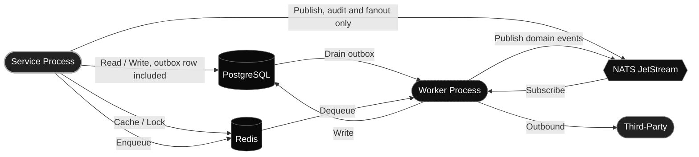

# Process view

> [!NOTE]
> The process view describes what runs concurrently and how those processes reach one another through the shared infrastructure.

A service process never publishes a domain event itself. It writes the event to its `event_outbox` table in the same transaction as the change, and the drainer job in its worker publishes it a moment later, so a commit and its event can never disagree. Audit records and the WebSocket fanout are the exception, since losing one costs nothing and neither carries state another service depends on.

A worker process is one of two kinds. A NATS subscriber holds durable consumers and keeps local projections up to date. An arq runner takes jobs from a Redis queue and runs the periodic work, the outbox drainer among it. Three services run one of each, four run only one.
