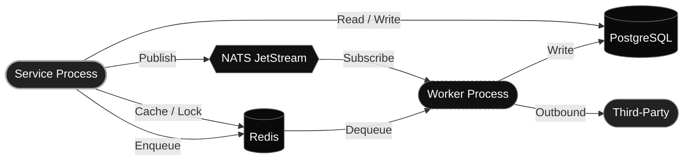

# Process view

> [!NOTE]
> The process view describes what runs concurrently and how those processes reach one another through the shared infrastructure.

```mermaid
flowchart LR
    svc(["Service Process"]):::svc

    pg[("PostgreSQL")]:::db
    redis[("Redis")]:::db
    nats{{"NATS JetStream"}}:::bus
    ext(["Third-Party"]):::ext

    worker(["Worker Process"]):::worker

    svc -->|"Read / Write"| pg
    svc -->|"Cache / Lock"| redis
    svc -->|"Publish"| nats
    svc -->|"Enqueue"| redis

    nats -->|"Subscribe"| worker
    redis -->|"Dequeue"| worker
    worker -->|"Write"| pg
    worker -->|"Outbound"| ext

    classDef svc    fill:#222,color:#fff,stroke:#aaa,stroke-width:2px
    classDef worker fill:#111,color:#fff,stroke:#666,stroke-width:1px,stroke-dasharray:3
    classDef db     fill:#0a0a0a,color:#fff,stroke:#666,stroke-width:1px
    classDef bus    fill:#111,color:#fff,stroke:#999,stroke-width:1px
    classDef ext    fill:#222,color:#fff,stroke:#777,stroke-width:1px
```

