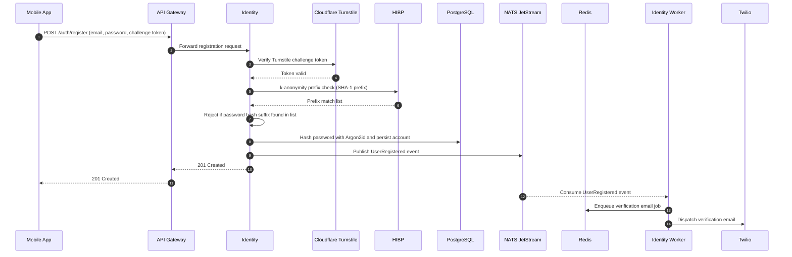
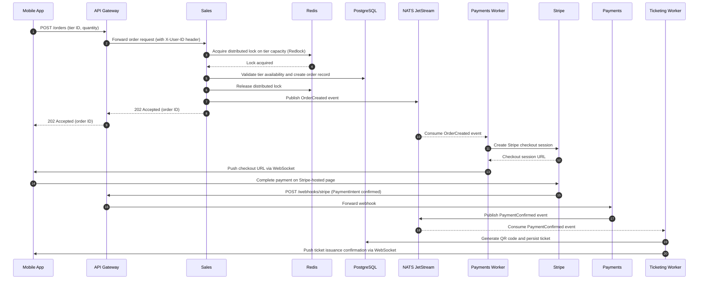
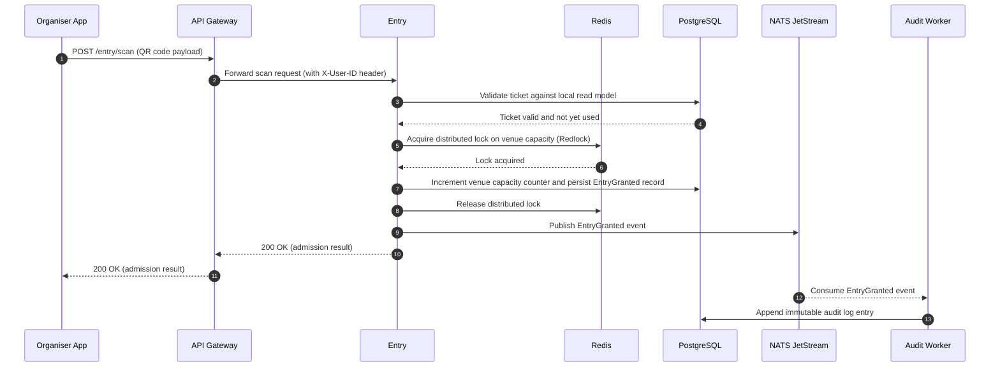

# Scenario view

> [!NOTE]
> The scenario view illustrates key system behaviours end to end, demonstrating how the architectural layers collaborate under realistic conditions.

The following situations present representative sequences that illustrate how the architectural layers collaborate under realistic conditions, covering the 3 core flows of the system.

**User Registration**

The following sequence traces an example of the full account creation flow, from the initial client request through external verification and asynchronous email dispatch.

**Ticket Purchase**

The following sequence traces the full ticket purchase flow, from order submission through distributed lock acquisition, payment initiation, webhook confirmation, and asynchronous ticket issuance.

**Entry Scanning**

The following sequence traces the admission flow, from QR code scan at the venue through capacity enforcement, event publishing, and real-time confirmation.

