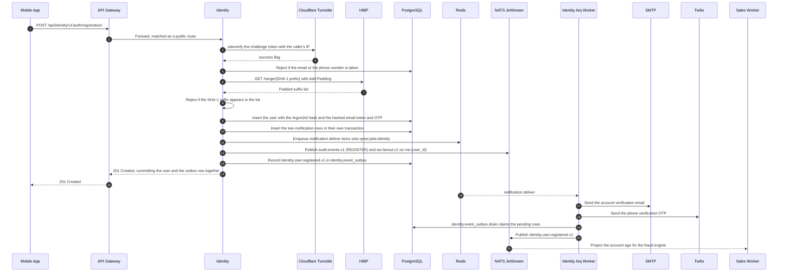
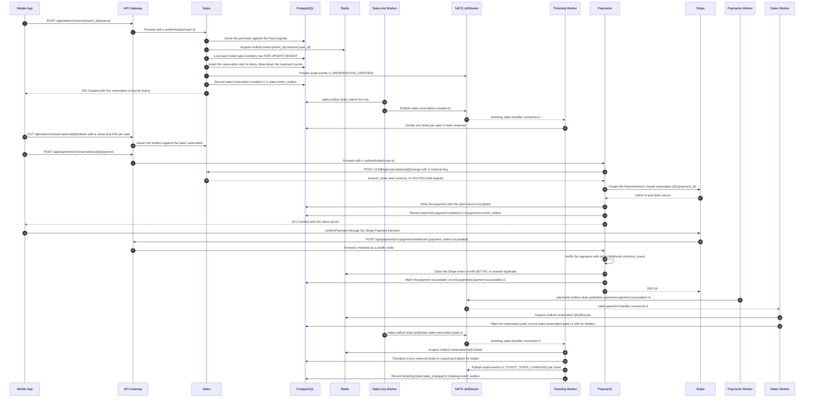
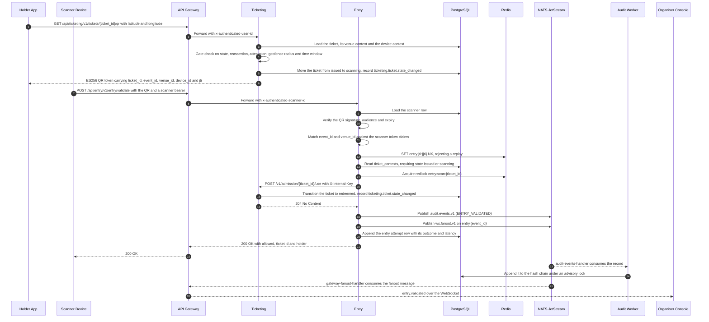

# Scenario view

> [!NOTE]
> The scenario view illustrates key system behaviours end to end, demonstrating how the architectural layers collaborate under realistic conditions.

The following situations present representative sequences that illustrate how the architectural layers collaborate under realistic conditions, covering the 3 core flows of the system. Every step traces a call that exists in the code, and every subject named is one from the [subject registry](../apps/api/messaging/subjects.md). Where a service publishes a domain event, it does not touch the broker inside the request: it writes a row into its `<schema>.event_outbox` table in the same transaction as the change, and a cron job on the matching arq worker publishes it a minute later at the latest. Audit records and the WebSocket fanout are the exception, and go straight to NATS.

**User Registration**

The following sequence traces the full account creation flow, from the initial client request through external verification, the notification queue and the outbox that announces the new account. Two things are worth reading closely. The verification email and the phone OTP are not domain events: they are rows in `identity.notifications` written in their own transaction, enqueued straight onto the arq queue in Redis, and delivered later by `notification.deliver`. They are therefore already committed and queued before the user row itself commits. And the audit record, published directly rather than through the outbox, drags a `ws.fanout.v1` message with it addressed to `me.{user_id}`, a channel the brand new account has nobody connected to yet.

**Ticket Purchase**

The following sequence traces the full purchase flow, from the reservation through holder naming, the PaymentIntent, the Stripe webhook and the issuance of the tickets. There is no order resource and no hosted Stripe Checkout page: the buyer confirms the intent in the app with the Payment Element and the client secret Payments returns. Capacity is not defended by the Redis lock, which is scoped per user and per event, but by a `SELECT ... FOR UPDATE NOWAIT` on each ticket type inventory row. The tickets themselves are created empty on the reservation and only transition to `issued` once the payment settles, so the chain from webhook to issued ticket crosses two outboxes and three workers. Nothing is pushed to the buyer at the end: the app has to poll.

**Entry Scanning**

The following sequence traces the admission flow, starting one step earlier than the door: the holder's app mints a short-lived QR from Ticketing, which is where the gate checks live. The geofence is one of those checks, and it is enforced when the QR is minted, not when it is scanned. Entry itself validates the signed QR against its own projections, claims the `jti` in Redis to stop a replay, and then makes the one synchronous call it needs, asking Ticketing to mark the ticket used. Entry publishes no domain event, only an audit record and the fanout the Gateway forwards to the organiser console. The scan path reads only `ticket_contexts`. The other two projections, `event_contexts` and `organisation_member_contexts`, serve a different question and a different caller: they are what lets Entry decide whether the organiser asking for a scanner token belongs to the event, which is the check that used to be an HTTP call to Catalog.

