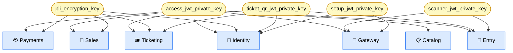

# Configuration

## Introduction

The following configuration layers are required to run the development stack, so ensure both are set up before proceeding to the setup guides:

- **Frontend** : environment variables in `apps/app/.env.local`
- **Backend** :  environment variables per-service in `config/local.yaml`

## Getting Started

Copy each example file that lists all available keys and fill in the required secrets before running the development stack:

### Frontend

```bash
cp apps/app/.env.example apps/app/.env.local
```

### Backend

```bash
cp apps/api/gateway/config/local.yaml.example apps/api/gateway/config/local.yaml
cp apps/api/services/identity/config/local.yaml.example apps/api/services/identity/config/local.yaml
cp apps/api/services/catalog/config/local.yaml.example apps/api/services/catalog/config/local.yaml
cp apps/api/services/sales/config/local.yaml.example apps/api/services/sales/config/local.yaml
cp apps/api/services/payments/config/local.yaml.example apps/api/services/payments/config/local.yaml
cp apps/api/services/ticketing/config/local.yaml.example apps/api/services/ticketing/config/local.yaml
cp apps/api/services/entry/config/local.yaml.example apps/api/services/entry/config/local.yaml
cp apps/api/services/audit/config/local.yaml.example apps/api/services/audit/config/local.yaml
```

#### Resolution Order

Backend services use [pydantic-settings](https://docs.pydantic.dev/latest/concepts/pydantic_settings/) to resolve values in the following order:

| Priority | Source | Example |
|---|---|---|
| 1 | Init | Passed at startup |
| 2 | Environment variable | `ACCESS_JWT_PRIVATE_KEY=...` |
| 3 | `.env` file | `.env` |
| 4 | `config/local.yaml` | `access_jwt_private_key: "..."` |
| 5 | `config.py` default | `access_jwt_private_key: str = ""` |

> [!NOTE]
> In practice, secrets go in `config/local.yaml`. Environment variables can override any value without modifying files, which is useful in CI or container deployments.

## Service Configuration

### Frontend

File: `apps/app/.env.local`

| Variable | Default | Required | Purpose |
|---|---|---|---|
| `VITE_API_URL` | `""` | no | Base URL for API calls. In dev Vite proxies to `localhost:8000`. |
| `VITE_GATEWAY_URL` | `""` | no | WebSocket gateway URL. In dev Vite proxies to `/ws`. |
| `VITE_GOOGLE_MAPS_API_KEY` | `""` | yes | Maps embed |
| `VITE_STRIPE_PUBLISHABLE_KEY` | `""` | yes | Stripe payment element |
| `VITE_TURNSTILE_SITE_KEY` | `""` | yes | Cloudflare Turnstile CAPTCHA |


### Backend

#### 🔀 Gateway

File: `apps/api/gateway/config/local.yaml`

| Key | Default | Required | Purpose |
|---|---|---|---|
| `port` | `8000` | yes | Listening port |
| `nats_url` | — | yes | NATS connection string |
| `redis_url` | — | yes | Redis connection string |
| `access_jwt_private_key` | — | yes | ES256 private key for access tokens |
| `setup_jwt_private_key` | — | yes | ES256 private key for the setup tokens issued during onboarding |
| `scanner_jwt_private_key` | — | yes | RS256 public key for scanner token validation |
| `jwt_audience` | — | no | Expected `aud` claim |
| `jwt_issuer` | — | no | Expected `iss` claim |
| `identity_url` | — | yes | Upstream identity service URL |
| `catalog_url` | — | yes | Upstream catalog service URL |
| `sales_url` | — | yes | Upstream sales service URL |
| `payments_url` | — | yes | Upstream payments service URL |
| `ticketing_url` | — | yes | Upstream ticketing service URL |
| `entry_url` | — | yes | Upstream entry service URL |


#### 🔑 Identity Service

File: `apps/api/services/identity/config/local.yaml`

| Key | Default | Required | Purpose |
|---|---|---|---|
| `port` | `8001` | yes | Listening port |
| `database_url` | — | yes | PostgreSQL connection string |
| `redis_url` | — | yes | Redis connection string |
| `nats_url` | — | yes | NATS connection string |
| `access_jwt_private_key` | — | yes | ES256 private key for access tokens |
| `setup_jwt_private_key` | — | yes | ES256 private key for account setup tokens |
| `recovery_jwt_private_key` | — | yes | ES256 private key for password recovery tokens |
| `refresh_jwt_private_key` | — | yes | ES256 private key for refresh tokens |
| `queue_jwt_private_key` | — | yes | ES256 private key for queue position tokens |
| `ticket_qr_jwt_private_key` | — | yes | ES256 private key for ticket QR tokens |
| `pii_encryption_key` | — | yes | Fernet key for PII field encryption |
| `national_id_encryption_key` | — | yes | Fernet key for KYC documents |
| `smtp_enabled` | `false` | no | Enable email delivery |
| `smtp_host` | — | no | SMTP server host |
| `smtp_port` | `587` | no | SMTP server port |
| `smtp_user` | — | no | SMTP username |
| `smtp_password` | — | no | SMTP password |
| `smtp_from_address` | — | no | SMTP from address |
| `twilio_enabled` | `false` | no | Enable SMS delivery |
| `twilio_account_sid` | — | no | Twilio account SID |
| `twilio_auth_token` | — | no | Twilio auth token |
| `twilio_from_number` | — | no | Twilio from number |
| `rp_id` | — | yes | Relying party ID |
| `rp_name` | — | yes | Relying party name |
| `rp_expected_origin` | — | yes | Expected origin for passkey verification |
| `captcha_enabled` | `false` | no | Enable Turnstile validation |
| `captcha_secret_key` | — | no | Cloudflare Turnstile secret key |
| `geoip_db_path` | — | no | Path to MaxMind GeoLite2 DB |
| `storage_root` | — | yes | Local directory for KYC document uploads |
| `storage_signing_key` | — | yes | HMAC secret for temporary URL KYC document uploads |


#### 📋 Catalog Service

File: `apps/api/services/catalog/config/local.yaml`

| Key | Default | Required | Purpose |
|---|---|---|---|
| `port` | `8002` | yes | Listening port |
| `database_url` | — | yes | PostgreSQL connection string |
| `redis_url` | — | yes | Redis connection string |
| `nats_url` | — | yes | NATS connection string |
| `access_jwt_private_key` | — | yes | ES256 private key for access tokens |
| `pii_encryption_key` | — | yes | Fernet key for PII field encryption |


#### 💸 Sales Service

File: `apps/api/services/sales/config/local.yaml`

| Key | Default | Required | Purpose |
|---|---|---|---|
| `port` | `8003` | yes | Listening port |
| `database_url` | — | yes | PostgreSQL connection string |
| `redis_url` | — | yes | Redis connection string |
| `nats_url` | — | yes | NATS connection string |


#### 💳 Payments Service

File: `apps/api/services/payments/config/local.yaml`

| Key | Default | Required | Purpose |
|---|---|---|---|
| `port` | `8004` | yes | Listening port |
| `database_url` | — | yes | PostgreSQL connection string |
| `redis_url` | — | yes | Redis connection string |
| `nats_url` | — | yes | NATS connection string |
| `stripe_secret_key` | — | yes | Stripe secret key |
| `stripe_webhook_signing_secret` | — | yes | Stripe webhook signing secret |
| `stripe_api_version` | — | yes | Stripe API version |
| `pii_encryption_key` | — | yes | Fernet key for PII field encryption |


#### 🎟️ Ticketing Service

File: `apps/api/services/ticketing/config/local.yaml`

| Key | Default | Required | Purpose |
|---|---|---|---|
| `port` | `8005` | yes | Listening port |
| `database_url` | — | yes | PostgreSQL connection string |
| `redis_url` | — | yes | Redis connection string |
| `nats_url` | — | yes | NATS connection string |
| `ticket_qr_jwt_private_key` | — | yes | ES256 private key for ticket QR tokens |


#### 🚪 Entry Service

File: `apps/api/services/entry/config/local.yaml`

| Key | Default | Required | Purpose |
|---|---|---|---|
| `port` | `8006` | yes | Listening port |
| `database_url` | — | yes | PostgreSQL connection string |
| `redis_url` | — | yes | Redis connection string |
| `nats_url` | — | yes | NATS connection string |
| `scanner_jwt_private_key` | — | yes | RS256 private key for issuing scanner session tokens |
| `ticket_qr_jwt_private_key` | — | yes | ES256 public key for ticket QR token verification |


#### 📜 Audit Service

File: `apps/api/services/audit/config/local.yaml`

| Key | Default | Required | Purpose |
|---|---|---|---|
| `port` | `8007` | yes | Listening port |
| `database_url` | — | yes | PostgreSQL connection string |
| `nats_url` | — | yes | NATS connection string |


#### ⚙️ Shared Settings

Every service shares the following optional settings:

| Key | Default | Purpose |
|---|---|---|
| `debug` | `false` | Enable debug mode and detailed error responses |
| `otel_enabled` | `false` | Enable OpenTelemetry tracing |
| `otel_endpoint` | `http://localhost:4317` | OTLP collector endpoint |
| `idempotency_enabled` | `true` | Enable idempotency key enforcement |
| `ratelimit_enabled` | `true` | Enable rate limiting |


## Shared Key Dependency Map

These variables must share the same value across services:

<div align="center">



</div>

## Generating Keys

To generate an ES256 private key:

```bash
python3 -c "
from cryptography.hazmat.primitives.asymmetric import ec
from cryptography.hazmat.primitives import serialization
k = ec.generate_private_key(ec.SECP256R1())
print(k.private_bytes(serialization.Encoding.PEM, serialization.PrivateFormat.PKCS8, serialization.NoEncryption()).decode())
"
```

To generate a Fernet key:

```bash
python3 -c "from cryptography.fernet import Fernet; print(Fernet.generate_key().decode())"
```
